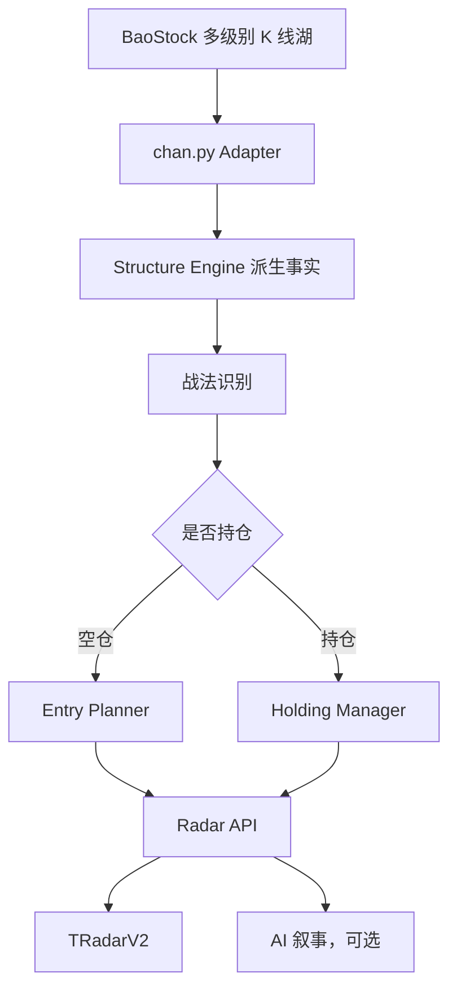
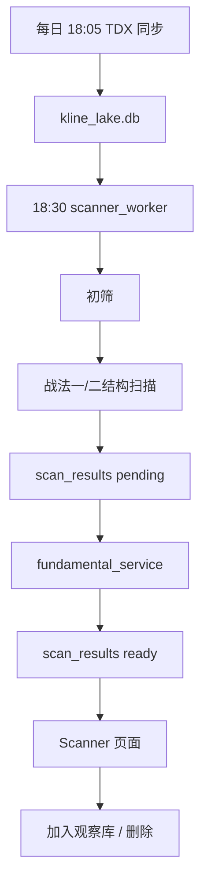
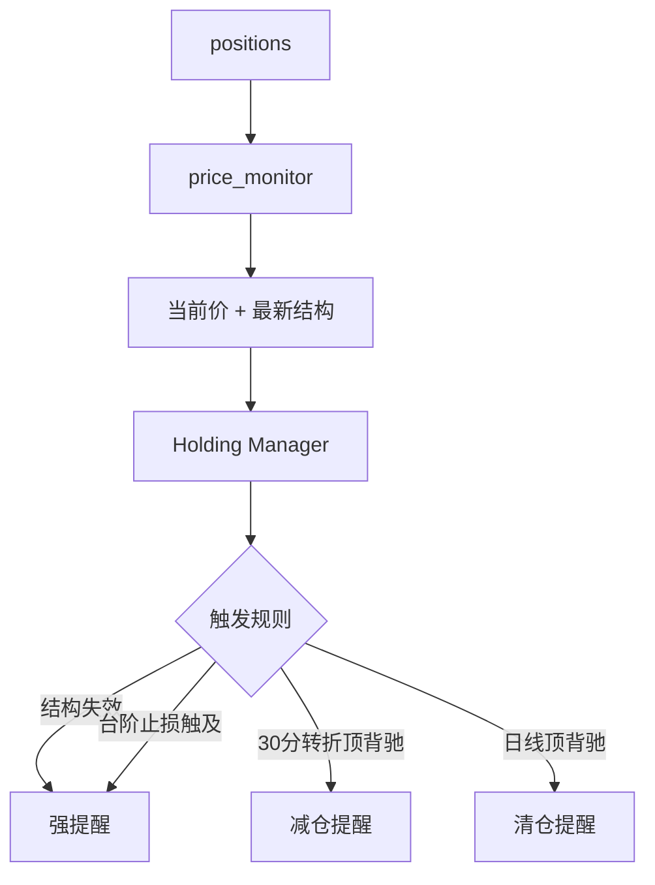
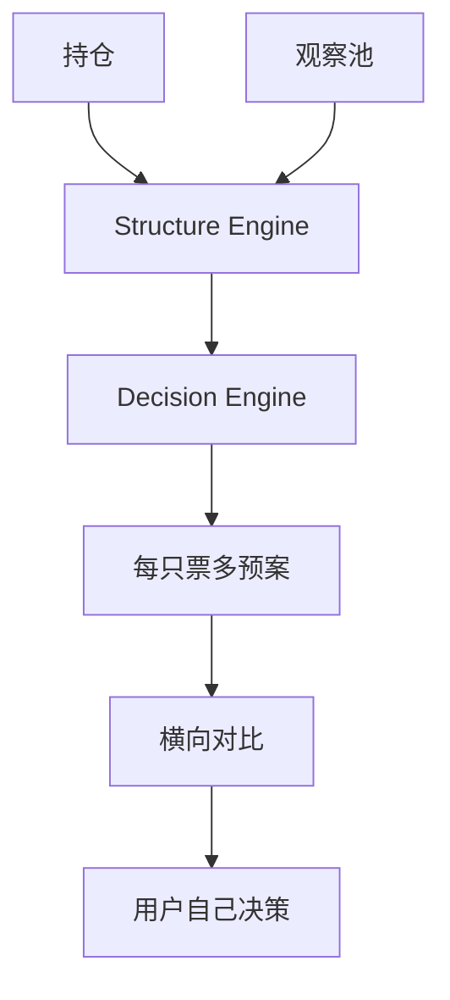

# CT-OS V4.0 架构重规划

> 版本：v0.2
> 日期：2026-04-24
> 目标：把 CT-OS 从“功能堆叠”整理成“交易教练操作系统”。

---

## 当前重建状态

截至 2026-04-24，本轮重建已经先完成底层 contract 和第一批兼容壳，不再直接从大文件开拆。

已完成：

1. 新增 `PRODUCT_ROADMAP.md`，把目标拆成 Phase 1 缠论分析工作台、Phase 2 策略教练与提醒、Phase 3 私有 QMT 日内 T 执行。
2. 新增 `docs/ARCHITECTURE_FOUNDATION_DECISIONS.md`，锁定底层不可逆决定。
3. 新增 `docs/DATA_SOURCE_CONTRACT.md`，锁定 TDX、BaoStock、腾讯、QMT 的权威边界。
4. 新增 `docs/STRUCTURE_ALGORITHM_INVENTORY.md`，确认基础缠论结构只以 `chan.py` 为权威。
5. 新增 `docs/STRATEGY_CONTRACT.md`，定义策略只输出 plans / alerts / execution intent candidates。
6. 新增 `docs/EXECUTION_INTENT_CONTRACT.md`，为未来 QMT 执行层预留隔离接口。
7. 新增 `docs/RADAR_API_CONTRACT.md`，定义 `/api/radar/{symbol}` 新 contract。
8. 新增 `docs/API_MIGRATION_STRATEGY.md`，定义 `/api/chan/matrix/v2` 到 `/api/radar/{symbol}` 的迁移策略和字段归属。
9. 新增 `server/api/radar.py`，第一版先包旧 matrix 引擎输出新 Radar contract。
10. 注册 `/api/radar` router。
11. 新增 `/api/chan/matrix/v2` characterization tests 和 `/api/radar/{symbol}` contract tests。

当前下一步：

1. 在测试保护下逐步拆 `chan_service.py`。
2. 继续补 `chan_adapter` derived facts 的结构派生能力，例如更细的中枢/买卖点生命周期和目标/止损锚。

2026-04-25 更新：

- 已新增 `docs/COACH_EVENT_CONTRACT.md`，为 Phase 2 提醒闭环、用户响应、行为纠偏和 Phase 3 审计预留事件模型。
- 已新增 `docs/API_MIGRATION_STRATEGY.md`，锁定 API 版本所有权、迁移阶段、`/api/chan/matrix/v2` 字段归属和 removal checklist。
- 事件 contract 明确 stale 数据不得触发交易动作提醒，只能记录数据过期阻断事件。
- 涉及买、卖、减仓、清仓、止损、仓位等动作的提醒必须包含“仅供参考”。
- 已新增 `docs/SYMBOL_FRESHNESS_WORKER_CONTRACT.md` 和 `server/domain/symbols.py`，把 symbol normalize、freshness、worker 写权限从原则推进到可测试 contract。
- 已新增 `server/engines/structure/chan_adapter.py` 和 adapter contract tests，第一版把 BaoStock lake -> CKLine_Unit -> CChan -> serialized levels 收敛到正式 adapter 边界。
- `/api/radar/{symbol}` 已使用 `chan_adapter` 输出 `structure/data_source/freshness`。
- 已新增 `server/engines/decision/radar_planner.py`，Radar API 不再直接组装 entry/holding plans。
- 已新增 `server/engines/decision/entry_planner.py` 和 `holding_manager.py`，空仓入场五条件与持仓六阶段状态机已从 API helper 迁入 decision 层。
- `radar_planner.py` 已移除对 `server.api.chan` 和 `chan_service._detect_holding_stage` 的 helper 依赖。
- 已新增 `server/engines/structure/derived_facts.py`，在 `chan_adapter` 的 `bis/zhongshus/bsps` 上派生 `price/zg/zd/state/zoushi_type/patterns/classifications`。
- `derived_facts.py` 已补 adapter-derived 背驰检测、背驰中继/转折分类和区间套检测，Radar 不再需要从旧 `chan_service.py` 获取这些事实。
- Structure Engine 已拆出 `divergence.py`、`nesting.py`、`zhongshu.py`、`lifecycle.py`、`strategy_detector.py` 纯函数模块，`derived_facts.py` 退化为聚合入口。
- 已新增 `server/engines/decision/risk_sizing.py` 和 `target_planner.py`，空仓目标价、持仓目标价、赔率、ATR 止损校验、固定风险仓位测算已从旧路径迁到 decision 层。
- 已新增 `server/domain/enums.py`、`models.py`、`contracts.py`，覆盖 Radar/Level/Plan/Risk 的领域对象草案；`server/data/` 和 `server/engines/coach/` 目标目录已建立。
- 已新增 `server/engines/decision/strategy_definitions.py`，落地 Strategy Contract 的版本化 strategy definitions；Radar 已消费 `war1_third_buy` 和 `holding_stage_manager`，Scanner API 已将旧 `war1` / `war2` 映射到 canonical strategy contract，Rotation API 已返回 `rotation_comparison` strategy contract，Push/Alerts 已在触发记录写入 strategy contract 快照。
- 已新增 `server/services/rotation_planner.py`，RotationCompass 已从“砍/加/换建议面板”切为持仓/候选横向比较，每只票返回甲乙丙预案；分数只保留为排序和底色信号。
- `BehaviorReport` 已收敛为纯交易行为分析，移除持仓防线扫描、`agent/radar_deduce` 和 `portfolio_strategy` 入口；行情结构复核回到 Radar / RotationCompass。
- Coach/Event Log 已落地最小三表 `coach_events`、`strategy_triggers`、`alert_deliveries`；提醒候选、策略触发快照、Scanner 用户动作已开始写入统一事件线。
- Phase D 持仓假设已落地：`positions.entry_thesis_json` 保存入场战法、级别、中枢、防守价、目标和触发条件；BUY 写入完整 thesis，CSV/缺结构路径写入未知降级 thesis，Radar 持仓模式读取该 thesis 做管理。
- Radar API 已移除旧 matrix decision 输入兜底；当前 `/api/radar/{symbol}` 正常路径完全消费 adapter-derived levels。
- `web/src/components/TRadarV2.jsx` 已切到 `/api/radar/{symbol}`，通过 `normalizeRadarContract()` 映射到现有 UI shape，视觉不改。
- Phase E 推送闭环已落地：`server/engines/decision/push_rules.py` 统一结构失效、台阶止损、背驰、扫描器重点候选的规则、文案和 strategy contract；`price_monitor` 与 scanner worker 已接入，并写入 Coach/Event Log。
- Phase F QMT 执行预留已新增 `docs/QMT_EXECUTION_ARCHITECTURE.md`，明确 Execution Layer、Risk Gate、Windows QMT Agent、QMT Adapter、Audit Log、dry-run、kill switch 和有底仓日内 T 前置条件；Phase 1/2 仍不暴露任何执行面。

## 一、核心判断

CT-OS 现在已经不是一个简单交易记录工具。实际系统已经长出七条能力线：

1. 交易记录与持仓计算
2. 本地 K 线数据湖
3. 缠论多级别结构分析
4. 雷达入场/持仓推演
5. 选股扫描器
6. 调仓罗盘
7. 行为教练与 AI 叙事

当前主要问题不是功能少，而是边界开始混在一起：

- `server/services/chan_service.py` 同时承担结构识别、战法判断、目标价、仓位、推演和持仓状态。
- 雷达、扫描器、调仓罗盘都在消费“缠论结构”，但各自有重复判断和不同口径。
- 空仓分析和持仓分析还没有在架构层彻底隔离。
- AI prompt 和规则判断边界不够硬，后续容易让 LLM 参与决策。
- 扫描器 worker 已有骨架，但 API、前端、基本面分析、操作闭环未打通。
- 自选股 schema 已迁移到 `watchlist_groups/watchlist_items`，部分旧接口仍按旧 `watchlist` 表查询。

这次重规划的目标是：先把“谁负责判断，谁负责叙事，谁负责展示，谁负责自动化”讲清楚。

---

## 二、产品内核

CT-OS 是交易教练，不是交易机器人。

它只做三件事：

1. **记录**：记录交易、持仓、观察池和每日结构快照。
2. **纠正**：发现用户的行为错误，例如死扛、早卖、逆势建仓、用分析对抗止损。
3. **提醒**：在结构进入关键节点时提醒用户检查，而不是替用户下单。

Phase 1 和 Phase 2 不得执行交易。

所有涉及交易动作的表达必须保持“仅供参考”，用户在券商 App 自行操作。

Phase 3 可以做用户私有 QMT 日内 T 执行，但必须作为独立 Execution Layer，并且只服务私有部署，不进入公开产品。

---

## 三、架构铁律

### 1. 缠论基础结构只认 `chan.py`

K 线包含、分型、笔、线段、中枢、买卖点等基础结构，只能来自 `server/vendor/chan_py`。

CT-OS 不再维护第二套权威缠论基础算法。现有 `chan_engine/parser.py`、`chan_engine/fsm.py` 等自研结构识别代码只能作为 legacy/reference，不再作为生产权威。

`server/services/chan_detail_service.py` 当前作为过渡 adapter，后续收敛到：

```text
server/engines/structure/chan_adapter.py
```

### 2. 算法判断和 AI 叙事分离

算法层输出结构化 JSON：

- 当前级别结构
- 买卖点生命周期
- 战法分类
- 入场条件
- 止损锚
- 目标价
- 仓位建议
- 持仓阶段
- 触发条件

AI 只能把这些字段翻译成自然语言。AI 不允许：

- 发明触发价
- 改写止损线
- 自行判断是否买入/卖出
- 在结构失效时安慰用户继续持有

### 3. 数据源权威边界固定

| 场景 | 权威数据源 | 口径 |
|---|---|---|
| Scanner 全市场日线扫描 | TDX 本地日线湖 | 不复权 |
| Radar/Chan 正式结构 | BaoStock 多级别湖 | 前复权 |
| 当前价展示/普通价格提醒 | 腾讯行情 | 真实当前价 |
| Phase 3 执行行情/账户/订单 | QMT / XtQuant | QMT 可执行上下文 |

同一次 `chan.py` 正式结构分析不得混用 TDX、BaoStock、腾讯，也不得混用复权口径。

腾讯实时数据可以生成 UI preview K 线，但不能写入正式结构判断。

### 4. 空仓模式和持仓模式分离

空仓模式回答：**要不要等，等什么，触发条件是什么。**

持仓模式回答：**结构是否仍有效，什么时候减，什么时候出。**

持仓期间不展示入场 checklist，不重新判断“现在能不能买”。这会诱导用户每天重新解释原始交易假设。

### 5. 页面服务决策动作，不堆功能

每个页面只回答一个主要问题：

| 页面 | 主要问题 |
|---|---|
| 缠论看盘 `ChanView` | 这只票现在结构如何？ |
| 今日机会 `Scanner` | 今天有哪些票值得放进观察池？ |
| 调仓罗盘 `RotationCompass` | 我手里的票和候选票，结构上怎么横向比较？ |
| 行为报告 `BehaviorReport` | 我这个交易者哪里反复犯错？ |
| 推演沙盘 `SandTable` | 我怎么训练结构推演能力？ |
| 小程序 | 如何快速记录、接收提醒、查看关键结论？ |

---

## 四、目标系统分层

```text
server/
  api/                 # HTTP 接口层，只做请求/响应编排
  domain/              # 领域对象、枚举、DTO
  data/                # 数据读取、数据湖、行情同步、元信息
  engines/
    structure/         # 纯结构判断，客观、可测试
    decision/          # 交易教练规则，空仓/持仓/调仓/扫描
    coach/             # 行为分析和纠偏
  services/            # LLM、推送、外部服务适配
  workers/             # 后台任务和调度入口
```

### 4.1 API Layer

职责：

- 参数校验
- 用户身份解析
- 调用 engine/service
- 返回稳定 JSON contract

不应该在 API 层写复杂交易规则。

目标接口：

| 模块 | 接口 |
|---|---|
| 交易 | `/api/trades/*` |
| 持仓 | `/api/positions/*` |
| 雷达 | `/api/radar/{symbol}` |
| K 线/结构详情 | `/api/chan/detail/{symbol}` |
| 扫描器 | `/api/scan/results`, `/api/scan/status`, `/api/scan/run` |
| 调仓罗盘 | `/api/rotation/compass` |
| 行为教练 | `/api/behavior/*` |
| 自选股 | `/api/watchlist/*` |
| 数据湖 | `/api/lake/*` |
| AI 叙事 | `/api/agent/*` |

短期可以保留 `/api/chan/matrix/v2/{symbol}`，但它应该逐步退化为 radar API 的兼容壳。

### 4.2 Domain Layer

新增 `server/domain/`，放跨模块共享的领域对象。

建议先定义：

```text
server/domain/
  enums.py
  models.py
  contracts.py
```

核心对象：

- `Trade`
- `Position`
- `Kline`
- `LevelStructure`
- `LifecycleNode`
- `StrategyClassification`
- `EntryPlan`
- `HoldingPlan`
- `ScanCandidate`
- `RiskPlan`

这层的价值是减少 dict 到处传。现在很多函数靠 `"zg"`, `"zd"`, `"patterns"`, `"forward_classes"` 这类隐式字段协作，容易一处改模板，另一处静默失效。

### 4.3 Data Layer

目标目录：

```text
server/data/
  market_data.py
  kline_repository.py
  trade_repository.py
  position_repository.py
  watchlist_repository.py
  scan_repository.py
  sync_status.py
```

职责：

- 读写 SQLite
- 查询 K 线数据湖
- 处理 symbol 格式转换
- 提供数据新鲜度
- 不写缠论规则
- 不写交易建议

数据库边界：

| 数据库 | 职责 |
|---|---|
| `ctos.db` | 用户、交易、持仓、提醒、自选、扫描结果、AI 快照 |
| `kline_lake.db` | 全市场 K 线缓存和同步元信息 |

### 4.4 Structure Engine

目标目录：

```text
server/engines/structure/
  chan_adapter.py
  matrix_engine.py
  zhongshu.py
  lifecycle.py
  nesting.py
  divergence.py
  strategy_detector.py
```

职责：

- 通过 `chan_adapter.py` 调用 `chan.py`
- 序列化笔/线段/中枢/买卖点
- 基于 `chan.py` 输出识别背驰、走势类型、生命周期等派生结构事实
- 识别走势类型
- 识别买卖点生命周期
- 识别战法一/战法二结构
- 输出客观结构 JSON

不输出“建议买入”“建议清仓”。

这层回答：**图上发生了什么？**

### 4.5 Decision Engine

目标目录：

```text
server/engines/decision/
  entry_planner.py
  holding_manager.py
  risk_sizing.py
  target_planner.py
  scanner_planner.py
  rotation_planner.py
  push_rules.py
```

职责：

- 把结构转换为交易教练规则
- 空仓入场计划
- 持仓管理计划
- 止损/目标/赔率
- 建议仓位
- 扫描候选分层
- 调仓横向比较
- 推送触发规则

这层回答：**用户下一步该注意什么？**

注意：这里可以输出“建议减仓”“建议清仓”，但必须来自明确规则，并在前端/推送中附带“仅供参考”。

### 4.6 Coach Layer

目标目录：

```text
server/engines/coach/
  behavior_engine.py
  behavior_coach.py
  trade_review.py
```

职责：

- 分析交易行为
- 识别用户习惯性错误
- 复盘止损执行率
- 复盘早卖、追涨、死扛、逆势
- 生成行为建议

这层不做当前行情结构判断。

### 4.7 Services Layer

目标目录：

```text
server/services/
  llm_service.py
  push_service.py
  fundamental_service.py
  eastmoney_service.py
```

职责：

- LLM 调用
- 微信/钉钉推送
- 东方财富抓取
- 外部服务重试和限流

### 4.8 Workers Layer

目标目录：

```text
server/workers/
  kline_sync_worker.py
  scanner_worker.py
  price_monitor.py
  daily_report.py
```

职责：

- 可重复运行
- 可记录日志
- 可失败重试
- 不依赖前端页面触发

---

## 五、核心数据流

### 5.1 雷达看盘



### 5.2 选股扫描器



### 5.3 持仓监控



### 5.4 调仓罗盘



调仓罗盘不应该以综合分为主。综合分最多用于排序，不应该成为用户看到的核心判断。

---

## 六、现有文件归宿

| 当前文件 | 目标归属 | 处理方式 |
|---|---|---|
| `server/app.py` | API 注册 | 保留，注册新 router |
| `server/db/database.py` | schema + repository 过渡层 | 短期保留，逐步抽 repository |
| `server/db/kline_lake.py` | `server/data/kline_repository.py` | 先保留，后迁移 |
| `server/services/chan_detail_service.py` | Structure Engine adapter | 拆出 chan adapter |
| `server/services/chan_service.py` | Structure + Decision 混合 | 第一优先级拆分 |
| `server/api/chan.py` | Radar API 兼容层 | 保留兼容，新增 `api/radar.py` |
| `server/services/rotation_scorer.py` | Decision Engine 旧罗盘 | 改为 `rotation_planner.py` |
| `server/workers/scanner.py` | `scanner_worker.py` | 保留入口，接 API 和 service |
| `server/services/chan_scanner.py` | scanner planner + structure adapter | 拆战法扫描逻辑 |
| `server/services/screener_filter.py` | scanner 初筛 | 保留，后迁移 |
| `server/services/behavior_engine.py` | Coach Layer | 迁移到 `engines/coach` |
| `server/services/behavior_coach.py` | Coach Layer | 迁移到 `engines/coach` |
| `server/services/llm_service.py` | Services Layer | 保留 |
| `server/services/push_service.py` | Services Layer | 保留并扩充 |
| `web/src/pages/ChanView.jsx` | 雷达看盘页面 | 保留 |
| `web/src/components/TRadarV2.jsx` | 雷达面板 | 保留，后按 contract 简化 |
| `web/src/pages/RotationCompass.jsx` | 调仓罗盘 | 重做为多预案横向比较 |
| `web/src/pages/BehaviorReport.jsx` | 行为教练 | 去掉不属于行为报告的持仓扫描入口 |
| `web/src/pages/SandTable.jsx` | 推演训练 | 保留 |

---

## 七、API Contract 方向

### 7.1 Radar API

目标接口：

```http
GET /api/radar/{symbol}?user_id=1
```

返回：

```json
{
  "api_version": "radar.v1",
  "symbol": "sh.600519",
  "mode": "EMPTY | HOLDING",
  "data_source": {},
  "freshness": {},
  "structure": {
    "levels": {},
    "systems": {},
    "summary": {}
  },
  "strategy": {
    "strategy_id": "war1_third_buy",
    "conditions": []
  },
  "entry_plan": null,
  "holding_plan": null,
  "plans": [],
  "alerts": [],
  "narrative": null,
  "disclaimer": "仅供参考，不构成投资建议"
}
```

规则：

- `mode=EMPTY` 时 `holding_plan=null`
- `mode=HOLDING` 时 `entry_plan=null`
- `plans` 必须由算法生成，不由 LLM 生成
- `structure` 必须能追溯到 `chan.py adapter`
- `data_source` 必须暴露 BaoStock / adjustflag / engine
- `freshness.is_stale=true` 时不得生成交易动作提醒

### 7.2 Scanner API

目标接口：

```http
GET /api/scan/results
GET /api/scan/status
POST /api/scan/run
DELETE /api/scan/results/{id}
```

候选卡片只展示 `ready` 状态。

加入观察库后删除 `scan_results` 对应记录，避免重复处理。

### 7.3 Rotation API

目标接口：

```http
GET /api/rotation/compass
```

返回不再以 `suggestions.cut/add/rotate` 为核心，而是：

```json
{
  "holdings": [
    {
      "symbol": "sz000001",
      "mode": "HOLDING",
      "structure_summary": {},
      "plans": [
        {"name": "甲", "condition": "...", "action": "..."},
        {"name": "乙", "condition": "...", "action": "..."},
        {"name": "丙", "condition": "...", "action": "..."}
      ]
    }
  ],
  "candidates": []
}
```

排序分可以保留为内部字段，但不作为主视觉。

---

## 八、数据库规划

### 8.1 立即需要修正

当前 schema 使用：

- `watchlist_groups`
- `watchlist_items`

旧查询必须停止使用 `watchlist` 表。

受影响模块：

- `server/api/rotation.py`
- 任何直接查询旧 `watchlist` 的服务

### 8.2 scan_results 补齐

PRD 中有 `fundamental TEXT` 字段，当前表缺失。

建议新增：

```sql
ALTER TABLE scan_results ADD COLUMN fundamental TEXT;
```

也可以先不存原始抓取结果，只存 LLM 摘要字段。若不存，需要在 PRD 中明确删掉 `fundamental` 字段。

### 8.3 持仓入场假设持久化

持仓模式必须记住“入场时的结构假设”，否则系统每天用当前结构重新解释历史交易。

现有字段：

- `positions.strategy_type`
- `positions.m5_entry_zg`
- `positions.entry_date`
- `positions.trailing_stop_price`

建议后续扩展：

```sql
ALTER TABLE positions ADD COLUMN entry_thesis_json TEXT;
```

保存：

- 入场战法
- 入场级别
- 入场中枢 ZG/ZD
- 原始止损
- 初始目标
- 入场触发条件

---

## 九、前端页面规划

### 9.1 ChanView

保留三栏结构：

- 左侧：观察池/自选股
- 中间：K 线图
- 右侧：雷达面板

目标是让右侧只消费 `Radar API contract`，减少对后端内部字段的耦合。

### 9.2 Scanner 今日机会

新增一级导航。

页面结构：

- 顶部：扫描日期、完成数量、失败数量、刷新状态
- 主区：候选卡片列表
- 操作：查看 K 线、加入观察库、删除

不在 Scanner 页面做深度看盘。深度看盘跳到 `ChanView`。

### 9.3 RotationCompass

重做为横向对比页面。

去掉“最强持仓分、最弱持仓分、建议砍出”这种主视觉。

改成：

- 持仓列表
- 候选列表
- 每只票展开后显示甲乙丙预案
- 触发条件、结构论据、仓位动作

系统给条件，不替用户拍板。

### 9.4 BehaviorReport

行为报告只分析用户交易行为。

不建议继续放“持仓防线扫描”这类行情结构功能。那应该属于雷达或调仓罗盘。

---

## 十、迁移计划

### Phase 0：止血和对齐

目标：修掉会让现有功能失真的问题。

任务：

1. 修 `server/services/chan_scanner.py` 中 `row` 未定义 bug。
2. 修 `server/api/rotation.py` 对旧 `watchlist` 表的查询。
3. 明确 `scan_results.fundamental` 字段是否保留。
4. 给扫描器核心函数补最小测试。

验收：

- 战法一扫描不会因变量错误静默失败。
- 调仓罗盘能从 `watchlist_groups/watchlist_items` 读取候选。
- 扫描结果表与 PRD 一致或 PRD 被同步修订。

### Phase 1：补齐扫描器产品闭环

目标：让“每日机会”变成用户能用的功能。

任务：

1. 新增 `server/api/scanner.py`。
2. 注册 `/api/scan/*`。
3. 新增 `web/src/pages/Scanner.jsx`。
4. 新增 `web/src/components/ScanCard.jsx`。
5. 加入观察库/删除/查看 K 线完整闭环。

验收：

- 用户可以看到今日 ready 候选股。
- 用户可以一键加入观察库。
- 加入后候选卡片消失。
- 查看 K 线跳到现有 `ChanView`。

### Phase 2：拆雷达 contract

目标：把雷达输出稳定下来，后续再拆内部实现。

任务：

1. [x] 新增 `server/api/radar.py`。
2. [x] 定义 `Radar API contract`。
3. [x] `/api/radar/{symbol}` 第一版兼容壳。
4. [x] `/api/chan/matrix/v2` 暂时保留兼容，并补 characterization tests。
5. [x] `TRadarV2` 改为消费稳定 contract。

验收：

- [x] 空仓模式没有持仓字段。
- [x] 持仓模式没有入场 plan。
- [x] Radar contract tests 覆盖基本互斥和 error envelope。
- [ ] AI 推演只消费算法 plans。

### Phase 3：拆 `chan_service.py`

目标：把最大风险文件拆开。

建议拆分顺序：

1. `structure/lifecycle.py`
2. `structure/nesting.py`
3. `structure/strategy_detector.py`
4. `decision/entry_planner.py`
5. `decision/holding_manager.py`
6. `decision/risk_sizing.py`
7. `decision/target_planner.py`

验收：

- 外部 API 输出不变。
- 现有测试通过。
- 新增单元测试覆盖每个拆出的纯函数。

### Phase 4：重做调仓罗盘

目标：从评分建议页变成结构预案横向对比页。

任务：

1. `rotation_scorer.py` 改造为 `rotation_planner.py`。
2. 输出每只票的多预案。
3. 前端展开行展示甲乙丙。
4. 分数只做排序，不做主视觉。

验收：

- 页面不再用“建议砍出/建议加仓”作为主表达。
- 用户能看到每只票的结构条件和触发边界。

### Phase 5：推送闭环

目标：让 CT-OS 从“打开才知道”变成“关键节点提醒”。

任务：

1. 持仓结构失效推送。
2. 台阶止损触发推送。
3. 30分转折顶背驰推送。
4. 扫描器第2/3/4层推送。
5. 假突破收回强化推送。

验收：

- 每类推送有去重策略。
- 每类推送有测试样例。
- 文案包含“仅供参考”。

---

## 十一、测试策略

### 11.1 Structure Engine

纯函数测试为主：

- 走势类型
- 生命周期节点
- 区间套 depth
- 窄幅盘整
- 假突破
- 战法一/二识别

### 11.2 Decision Engine

规则测试为主：

- 空仓五条件
- 赔率门控
- ATR 合理性
- 持仓 Stage 0-5
- 战法二中继/转折背驰分叉
- 结构失效优先级

### 11.3 API

Contract 测试：

- 空仓返回 `entry_plan`
- 持仓返回 `holding_plan`
- 不同模式字段互斥
- scanner 状态流转
- watchlist 操作

### 11.4 Frontend

重点测：

- Scanner 卡片操作
- ChanView 股票跳转
- TRadarV2 空仓/持仓互斥展示
- RotationCompass 展开预案

---

## 十二、近期不要做的事

1. 不要先大规模移动文件。先补 contract 和测试。
2. 不要让 LLM 参与结构判断。
3. 不要在调仓罗盘继续强化综合分。
4. 不要把 Scanner 做成第二个 ChanView。
5. 不要在持仓模式展示入场 checklist。
6. 不要新增另一个行情数据源来绕过数据湖问题。

---

## 十三、第一批具体任务

原始第一批任务：

1. [x] 修扫描器战法一变量 bug。
2. [x] 修 rotation 旧 watchlist 查询。
3. [x] 新增 scanner API。
4. [x] 新增 Scanner 页面和 ScanCard。
5. [x] 写 `Radar API contract` 草案。
6. [x] 给 `/api/chan/matrix/v2` 拆分前补 characterization tests。
7. [x] 新增 `/api/radar/{symbol}` 兼容壳和 contract tests。

这些任务完成后，系统会从“能力很多”变成“产品闭环清楚”。然后再拆大文件，风险会小很多。

新的第一批后续任务：

1. [x] 写 `docs/COACH_EVENT_CONTRACT.md`。
2. [x] 定义 symbol normalize 和 freshness 的代码 contract。
3. [x] 新增 `server/engines/structure/chan_adapter.py`。
4. [x] 让 `/api/radar/{symbol}` 从兼容壳逐步切到 adapter + decision engine。
   - [x] structure/data_source/freshness 切到 `chan_adapter` 优先。
   - [x] strategy/plans 组装边界切到 `server.engines.decision.radar_planner`。
   - [x] 空仓 entry checklist 替换为 `entry_planner`。
   - [x] 持仓 holding status 替换为 `holding_manager`。
   - [x] 移除 `_detect_holding_stage` legacy 依赖。
   - [x] Radar decision 输入优先使用 `chan_adapter` derived levels。
   - [x] 移除旧 matrix decision 输入兜底。
   - [x] 移除 Radar API 对旧 matrix 的 decision 输入依赖。
5. [x] 前端 `TRadarV2` 切换到 Radar contract。
