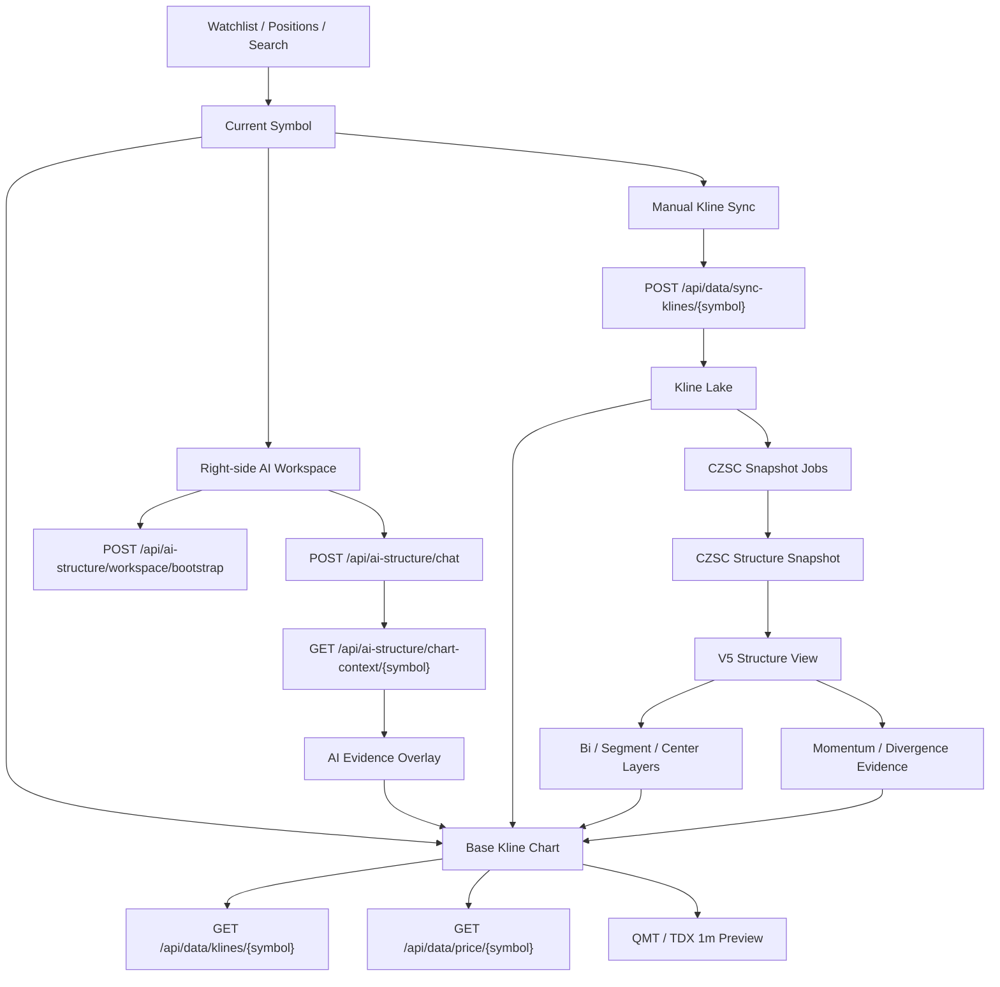

# AI Native V5 Kline Workspace Requirements

## 背景

AI Native V5 的目标不是删除看盘工具，而是把结构算法主线从旧 `chan.py` / 旧 radar 迁移到 CZSC。

原有看盘工具至少包含 K 线、笔、线段、中枢、级别切换、指标、当前股票刷新和自选股联动。V5 的 AI 问答和轻量证据展示不能替代这些基础看盘能力。

本需求文档定义 V5 看盘工具的产品边界、底层数据流、接口调用、Kline 功能、CZSC 结构图层和背驰力量层。后续实现应以本文为准，避免再次把“移除旧结构引擎”误解为“移除看盘能力”。

## 核心原则

- Kline 是主画布，AI 是叠加解释层。
- 看盘工具必须支持用户主动对比结构，而不是只等待 AI 回答。
- V5 结构来源固定为 CZSC，不恢复旧 `chan.py`、旧 radar、旧 `/api/chan/detail`。
- 普通 K 线展示不依赖 AI context；打开股票后必须立即可看图。
- CZSC 笔、线段、中枢来自 V5 snapshot / structure view，不从旧结构接口读取。
- 背驰力量只做轻量证据层，服务“力度增强/衰减/不足判断”，不生成交易指令。
- AI chart-context 只负责当前回答相关证据高亮，不负责基础看盘图层。
- 所有涉及交易动作的回答仍必须保留“仅供参考，不构成投资建议”。

## 目标用户体验

用户点击 watchlist、持仓“看盘”或搜索股票后：

1. 中间主画布立即显示基础 K 线。
2. 用户可以切换周线、日线、60 分、30 分、15 分、5 分、1 分。
3. 用户可以打开/关闭笔、线段、中枢、背驰力量、AI 证据图层。
4. 用户可以手动刷新当前股票 K 线。
5. 右侧 AI 工作台显示结构流水线状态，并允许自然语言提问。
6. AI 回答后，在同一张 K 线图上叠加当前回答相关的中枢、触发线、失败线、当前价线。
7. 即使 AI context 不存在、pending 或 stale，基础 K 线仍然可用。

## 非目标

以下能力不在本次恢复范围：

- 恢复旧 `chan.py`。
- 恢复旧 radar / TRadar / RadarPanel。
- 恢复旧 scanner / rotation / sand table / playbook。
- 恢复旧 `/api/chan/detail` 作为 V5 前端依赖。
- 在页面请求内同步执行重型 CZSC 计算。
- 让背驰力量输出“买入/卖出/加仓/清仓”结论。
- 默认展示复杂多级别区间套全图。

## 整体关系



## 底层数据流

### 1. 股票选择流

来源：

- `watchlist_items`
- `positions`
- 最近聊天股票
- 搜索结果

接口：

```http
GET /api/watchlist
GET /api/positions/overview
GET /api/ai-structure/universe?sources=positions,watchlist,recent_chat
GET /api/data/search?q=...
```

约束：

- 股票选择只决定 `current_symbol`。
- 股票选择不能触发同步结构计算。
- `current_symbol` 必须同时驱动 Base Kline Chart 和右侧 AI Workspace。

### 2. 基础 K 线展示流

接口：

```http
GET /api/data/klines/{symbol}?interval=week&count=1200
GET /api/data/klines/{symbol}?interval=day&count=1200
GET /api/data/klines/{symbol}?interval=m60&count=1200
GET /api/data/klines/{symbol}?interval=m30&count=1200
GET /api/data/klines/{symbol}?interval=m15&count=1200
GET /api/data/klines/{symbol}?interval=m5&count=1200
```

行为：

- 切换股票时立即请求当前周期 K 线。
- 切换周期时只刷新 K 线数据和当前周期图层。
- 数据不足时显示明确空态。
- 基础 K 线不等待 AI context。

### 3. 1 分钟 / 盘中预览流

接口：

```http
GET /api/data/tdx/minute/health?symbol={symbol}
GET /api/data/qmt/klines/{symbol}?period=1m&count=240&cache_closed=false
GET /api/data/tdx/minute/{symbol}?count=240
```

行为：

- 1 分钟只作为 display-only / intraday preview。
- QMT 可用时优先 QMT 预览。
- QMT 不可用时回退 TDX 本地分钟。
- 盘中 forming K 不进入正式 CZSC snapshot。
- UI 必须标记“预览，不参与结构判断”。

### 4. 当前价流

接口：

```http
GET /api/data/price/{symbol}
GET /api/data/prices?symbols=...
```

行为：

- Base Kline Chart 可显示当前价线。
- Reminder / price monitor 可以用当前价判断提醒触发。
- 当前价线是实时参考，不写入结构快照。

### 5. 当前股票手动刷新流

接口：

```http
POST /api/data/sync-klines/{symbol}
```

期望返回：

```json
{
  "status": "success",
  "symbol": "sh.600406",
  "freqs": ["week", "day", "60", "30", "15", "5"],
  "total_written": 123,
  "errors": 0,
  "structure_jobs": {
    "count": 6,
    "items": []
  }
}
```

行为：

- 前端显示刷新进度。
- 刷新完成后重新加载 Base Kline Chart。
- 若 K 线变化，后台入队 CZSC snapshot/context job。
- 请求内不得同步执行重型 CZSC。

### 6. V5 结构生成流

接口：

```http
POST /api/ai-structure/pipeline/ensure
POST /api/ai-structure/snapshots/prewarm
POST /api/ai-structure/contexts/prewarm
GET /api/ai-structure/contexts/status/{symbol}
```

行为：

- 用户可以手动生成上下文。
- 第一次提问可触发 ensure。
- Snapshot Worker / Context Worker 后台处理。
- 右侧状态展示 pending / fresh / stale / failed / no_data。
- 基础 K 线不被 pending 状态阻塞。

### 7. AI 问答与证据叠加流

接口：

```http
POST /api/ai-structure/chat
GET /api/ai-structure/chart-context/{symbol}?context_id=...&level=5&evidence_ids=...
```

行为：

- Chat 只读取最新 AI Structure Context，不重算结构。
- Chat 返回 `chart_focus`。
- 前端根据 `chart_focus` 请求 `chart-context`。
- `chart-context` 返回当前回答相关证据。
- Base Kline Chart 在当前主图上叠加 AI Evidence Overlay。
- 无 context / pending / stale 时，Chat 返回受控降级答案，不影响基础 K 线。

## 接口与功能映射

| 功能 | 前端模块 | 接口 | 是否依赖 AI context | 是否参与结构判断 |
|---|---|---|---|---|
| 自选股列表 | WatchlistPanel | `GET /api/watchlist` | 否 | 否 |
| 股票搜索 | StockSearch | `GET /api/data/search` | 否 | 否 |
| 基础 K 线 | BaseKlineChart | `GET /api/data/klines/{symbol}` | 否 | 否 |
| 1 分钟预览 | BaseKlineChart | `GET /api/data/qmt/klines` / `GET /api/data/tdx/minute` | 否 | 否 |
| 当前价线 | BaseKlineChart | `GET /api/data/price/{symbol}` | 否 | 否 |
| 手动刷新 | Kline Toolbar | `POST /api/data/sync-klines/{symbol}` | 否 | 间接入队 |
| CZSC 状态 | AI Workspace | `GET /api/ai-structure/contexts/status/{symbol}` | 是 | 是 |
| 笔/线段/中枢图层 | Structure Layers | 新 V5 structure view | 否 | 来自 snapshot |
| 背驰力量 | Momentum Layer | 新 V5 momentum context | 否 | 只作证据 |
| AI 回答 | Coach Panel | `POST /api/ai-structure/chat` | 是 | 否 |
| AI 证据叠加 | Evidence Overlay | `GET /api/ai-structure/chart-context/{symbol}` | 是 | 否 |

## Kline 主画布功能

### 必须恢复

- 股票切换后立即显示 K 线。
- 周线 / 日线 / 60 分 / 30 分 / 15 分 / 5 分 / 1 分切换。
- 蜡烛图。
- 成交量。
- 缩放、拖动、十字光标。
- OHLC tooltip。
- 自适应窗口大小。
- 数据不足空态。
- 当前价线。
- 手动刷新当前股票。
- 本地记忆周期、指标、图层开关。

### 指标

主图：

- `MA`
- `BOLL`
- `None`

副图：

- `MACD`
- `KDJ`
- `RSI`

成交量：

- `VOL`

### 图层预设

建议第一版预设：

- 裸 K：只显示 K 线。
- 标准：K 线 + MA + VOL + MACD。
- CZSC 结构：K 线 + 笔 + 线段 + 中枢。
- AI 证据：K 线 + 当前回答证据。
- 力量对比：K 线 + 最近同向段力度比较。

不建议恢复“全标注”命名，避免重新滑向旧复杂图层。

## CZSC 结构图层

### 必须支持

- 当前级别笔。
- 当前级别线段。
- 当前级别中枢。
- active center 高亮。
- 图层开关。
- 结构数据状态 badge。

### 数据来源

必须来自 V5 CZSC snapshot / structure view。

建议新增或完善：

```http
GET /api/ai-structure/structure-view/{symbol}?level=5&count=1200
```

建议返回：

```json
{
  "symbol": "sh.600406",
  "level": "5",
  "snapshot_id": "v5snap_xxx",
  "engine": "czsc",
  "status": "fresh",
  "data_as_of": "2026-05-15 15:00:00",
  "klines": [],
  "layers": {
    "bis": [],
    "segments": [],
    "centers": [],
    "active_center": {}
  }
}
```

### 约束

- 不调用旧 `/api/chan/detail`。
- 不读取旧 radar 输出。
- 不在前端自己计算笔、线段、中枢。
- 页面请求只读 snapshot / view，不重算 CZSC。
- 如果 structure view 不可用，基础 K 线仍然显示。

## 背驰力量层

### 目标

回答：

> 当前这一段上攻/下跌的力量，是增强、衰减，还是不足判断？

服务用户问题：

- 这次突破有力吗？
- 是不是背驰了？
- 这次反弹是不是弱？
- 跌下来力度大不大？

### 指标

第一版只做轻量、可解释指标：

- 当前段涨跌幅。
- 当前段 K 线数量。
- 当前段成交量合计 / 均量。
- MACD histogram 面积。
- 单位 K 涨跌幅 / 斜率。
- 与上一同向段对比。

### 建议接口

```http
GET /api/ai-structure/momentum-context/{symbol}?level=5&count=1200
```

建议返回：

```json
{
  "symbol": "sh.600406",
  "level": "5",
  "direction": "up",
  "current_leg": {
    "start_time": "2026-05-15 10:30:00",
    "end_time": "2026-05-15 13:20:00",
    "price_change_pct": 3.2,
    "bar_count": 18,
    "macd_area": 12.8,
    "volume_sum": 48300000,
    "slope": 0.18
  },
  "previous_leg": {
    "start_time": "2026-05-14 13:30:00",
    "end_time": "2026-05-15 09:50:00",
    "price_change_pct": 4.1,
    "bar_count": 22,
    "macd_area": 20.5,
    "volume_sum": 61200000,
    "slope": 0.19
  },
  "verdict": "weakening",
  "confidence": 0.68,
  "explanation": "价格创新高，但 MACD 面积和成交量低于上一段，上攻力度衰减。"
}
```

### 图上展示

- 高亮当前比较段。
- 高亮上一同向比较段。
- 显示两个力度标签。
- 显示结论 badge：增强 / 衰减 / 不足判断。
- 不画满全图。
- 不生成买卖点。

### AI 使用方式

AI 可以引用背驰力量，但不能把它变成交易指令。

允许回答：

```text
当前 5 分钟上攻段相对上一段出现力度衰减，MACD 面积和成交量都没有同步放大。
这说明追高风险上升，但不等于马上卖出。仍然要结合触发线和失败线复核。
仅供参考，不构成投资建议。
```

禁止回答：

```text
顶背驰，马上卖。
底背驰，立刻买。
```

## AI Evidence Overlay

AI 证据层是 Kline 主画布的叠加层，不是 Kline 主画布本身。

来源：

```http
GET /api/ai-structure/chart-context/{symbol}?context_id=...&level=...&evidence_ids=...
```

展示：

- 当前回答相关中枢。
- 触发线。
- 失败线。
- 当前价线。
- 被引用 K 线区间。

约束：

- 默认不展示所有级别。
- 默认不展示完整结构报告。
- 只展示当前回答相关证据。
- 用户换问题后证据随回答变化。
- 用户关闭 AI 证据层后，基础 Kline 和 CZSC 结构层仍可独立使用。

## 推荐前端模块

建议结构：

```text
web/src/features/kline/
  BaseKlineChart.jsx
  BaseKlineChart.css
  klineClient.js
  klineIndicators.js
  klinePreferences.js
  StructureLayerOverlay.jsx
  MomentumOverlay.jsx
  AIEvidenceOverlay.jsx
```

页面组合：

```text
AIStructureWorkspace
  ├── WatchlistPanel
  ├── StockSearch
  ├── BaseKlineChart
  │   ├── Kline data
  │   ├── CZSC StructureLayerOverlay
  │   ├── MomentumOverlay
  │   └── AIEvidenceOverlay
  └── AIStructureCoachPanel
```

## 推荐后端模块

建议新增或整理：

```text
server/engines/ai_native/structure_view_service.py
server/engines/ai_native/momentum_context_service.py
server/api/ai_structure.py
```

接口：

```http
GET /api/ai-structure/structure-view/{symbol}?level=5&count=1200
GET /api/ai-structure/momentum-context/{symbol}?level=5&count=1200
GET /api/ai-structure/chart-context/{symbol}?context_id=...&level=...&evidence_ids=...
```

其中：

- `structure-view` 给看盘工具长期展示笔、线段、中枢。
- `momentum-context` 给背驰力量层。
- `chart-context` 给 AI 当前回答证据。

## 与现有 V5 的关系

已有能力：

- `GET /api/data/klines/{symbol}` 可返回基础 K 线。
- `POST /api/data/sync-klines/{symbol}` 可刷新当前股票。
- `POST /api/ai-structure/workspace/bootstrap` 可返回股票池和 AI 状态。
- `POST /api/ai-structure/chat` 可回答自然语言问题。
- `GET /api/ai-structure/chart-context/{symbol}` 可返回当前回答证据。

缺失能力：

- 前端基础 Kline 主画布。
- V5 structure view API，专门服务笔、线段、中枢展示。
- 背驰力量 context API。
- 将 AI evidence overlay 叠加到主 Kline，而不是单独占据主画布。

## 验收标准

### 基础看盘

- 打开任意 watchlist 股票，不提问 AI，也能看到 K 线。
- 周线、日线、60 分、30 分、15 分、5 分可切换。
- K 线可以缩放、拖动、显示十字光标。
- 当前价线可显示。
- 手动刷新当前股票后图表重新加载。

### CZSC 结构

- 当前级别笔可开关。
- 当前级别线段可开关。
- 当前级别中枢可开关。
- active center 可高亮。
- 图层数据来自 V5 CZSC snapshot / structure view。
- 禁止调用旧 `/api/chan/detail`。

### 背驰力量

- 可显示当前段与上一同向段的力度对比。
- 至少包含 MACD area、成交量、涨跌幅。
- 图上只高亮两段，不铺满全图。
- AI 可引用“增强/衰减/不足判断”，但不输出交易指令。

### AI 证据

- AI 回答后叠加触发线、失败线、当前回答相关中枢。
- 无 AI 回答时基础 K 线仍可用。
- AI context pending / stale 时基础 K 线仍可用。

### 隔离

- 不恢复旧 radar。
- 不恢复旧 `chan.py`。
- 不恢复旧 scanner / sand table / rotation。
- 不在页面请求内同步执行重型 CZSC。

## 实施顺序建议

1. 恢复 Base Kline Chart，只接 `/api/data/klines` 和当前价。
2. 接入手动刷新当前股票。
3. 新增 V5 `structure-view`，返回 CZSC 笔、线段、中枢。
4. 在 Base Kline Chart 上叠加笔、线段、中枢图层。
5. 新增 `momentum-context`，做背驰力量对比。
6. 在 Base Kline Chart 上叠加 momentum overlay。
7. 将现有 AI Evidence Chart 改为 Base Kline Chart 的 AI overlay。
8. 做 QA，确认 watchlist、持仓看盘、AI 问答、提醒、复盘链路互不阻塞。

## Engineering Review

### 总体判断

后端主体已经具备落地条件，关键缺口在前端主画布。

当前后端已经具备：

- K 线读取。
- 当前价读取。
- 当前股票手动同步。
- watchlist / positions / universe。
- workspace bootstrap。
- AI chat。
- chart-context 证据叠加数据。
- contexts status。
- pipeline ensure。
- QMT / TDX 预览数据源。

当前缺失：

- `GET /api/ai-structure/structure-view/{symbol}`。
- `GET /api/ai-structure/momentum-context/{symbol}`。
- 前端 Base Kline Chart 主画布。
- Kline 指标、周期切换、图层预设、CZSC 图层、背驰力量图层。

因此，工程策略不应继续扩展 AI 右侧回答，而应先恢复 Kline 主画布。

### Endpoint Readiness

| Endpoint | 状态 | 用途 |
|---|---|---|
| `GET /api/data/klines/{symbol}` | 已有 | 基础 K 线 |
| `GET /api/data/price/{symbol}` | 已有 | 当前价线 |
| `GET /api/data/prices` | 已有 | 批量当前价 |
| `POST /api/data/sync-klines/{symbol}` | 已有 | 当前股票手动刷新 |
| `GET /api/data/search` | 已有 | 股票搜索 |
| `GET /api/data/qmt/klines/{symbol}` | 已有 | QMT 盘中预览 |
| `GET /api/data/tdx/minute/{symbol}` | 已有 | TDX 1 分钟展示/回放 |
| `GET /api/watchlist` | 已有 | 自选股 |
| `GET /api/positions/overview` | 已有 | 持仓与看盘跳转 |
| `POST /api/ai-structure/workspace/bootstrap` | 已有 | AI 工作台首屏状态 |
| `POST /api/ai-structure/chat` | 已有 | 自然语言问答 |
| `GET /api/ai-structure/chart-context/{symbol}` | 已有 | AI 当前回答证据 |
| `GET /api/ai-structure/contexts/status/{symbol}` | 已有 | 结构流水线状态 |
| `POST /api/ai-structure/pipeline/ensure` | 已有 | 后台补齐结构流水线 |
| `GET /api/ai-structure/universe` | 已有 | 观察池 |
| `GET /api/ai-structure/structure-view/{symbol}` | 缺失 | CZSC 笔 / 线段 / 中枢图层 |
| `GET /api/ai-structure/momentum-context/{symbol}` | 缺失 | 背驰力量对比 |

### Charting Library Decision

使用 `klinecharts` 作为主图渲染引擎。

理由：

- 项目依赖中已经包含 `klinecharts@10.0.0-beta1`。
- 原有看盘工具也是围绕 KlineCharts 方向构建。
- 它原生支持蜡烛图、成交量、副图、缩放、拖动、十字光标和自定义 overlay。
- 自研 SVG 当前只能做 AI evidence preview，不适合 1200 根 K 线、指标和交互式看盘。

要求：

- 第一阶段就验证 KlineCharts 自定义 overlay API，避免后续 CZSC 图层接入时踩坑。
- 固定当前版本，避免 beta API 漂移。
- Base Kline Chart 不依赖 AI evidence SVG。

### 关键工程风险

#### R1: KlineCharts 自定义 overlay API 复杂度

风险：

- 笔、线段、中枢、AI evidence、背驰力量都需要 overlay。
- v10 beta API 可能存在未文档化行为。

缓解：

- Phase 1 就做最小 overlay spike。
- 不等到 Phase 3 才验证图层能力。

#### R2: CZSC 结构坐标映射

风险：

- CZSC 输出通常以 datetime 为坐标。
- KlineCharts overlay 需要映射到 bar / timestamp。
- 多周期切换时容易错位。

缓解：

- `structure-view` 后端返回 `bar_index` 与 `time` 双坐标。
- 前端只负责绘制，不猜测结构点属于哪根 K。

#### R3: 1 分钟预览源不稳定

风险：

- QMT 桥不一定可用。
- TDX 本地分钟可能滞后。

缓解：

- 1 分钟明确标记 `display-only`。
- 不参与 CZSC snapshot。
- 作为 Phase 6，不阻塞基础看盘恢复。

#### R4: 重新滑回旧结构复杂度

风险：

- 恢复笔、线段、中枢后，容易顺手恢复旧 radar / 旧 chan 图层。

缓解：

- 所有结构图层只读 V5 `structure-view`。
- 测试禁止调用旧 `/api/chan/detail`、旧 radar、旧 `chan.py`。

### Recommended Build Phases

#### Phase 1: Base Kline

目标：

- 用户点 watchlist / 持仓 / 搜索后，主画布立即显示 K 线。

范围：

- `BaseKlineChart.jsx`。
- `klineClient.js`。
- 周 / 日 / 60 / 30 / 15 / 5 周期切换。
- 蜡烛图 + 成交量。
- 当前价线。
- 缩放、拖动、十字光标、OHLC tooltip。
- 手动刷新当前股票。
- 本地偏好 `ct_kline_*`。
- 拖动边界保护：不能左右拖出整屏无数据黑屏。

验收：

- 任意 60 根以上 K 线股票，连续左右拖动、最大缩放、最小缩放、切换周期后都不能出现整屏黑屏。

#### Phase 2: Indicators

范围：

- `MA`。
- `BOLL`。
- `VOL`。
- `MACD`。
- `KDJ`。
- `RSI`。
- 主图 / 副图指标选择。

#### Phase 3: CZSC Structure Layer

后端：

- `structure_view_service.py`。
- `GET /api/ai-structure/structure-view/{symbol}`。
- 返回 K 线坐标、笔、线段、中枢、active center、snapshot status。

前端：

- `StructureLayerOverlay.jsx`。
- 笔 / 线段 / 中枢图层开关。
- CZSC 结构状态 badge。

#### Phase 4: Momentum Layer

后端：

- `momentum_context_service.py`。
- `GET /api/ai-structure/momentum-context/{symbol}`。
- 基于最近同向段计算涨跌幅、K 数量、MACD area、成交量、斜率。

前端：

- `MomentumOverlay.jsx`。
- 当前段与上一同向段高亮。
- 结论 badge：增强 / 衰减 / 不足判断。

#### Phase 5: AI Evidence Overlay

范围：

- 将现有 `AIStructureEvidenceChart` 的能力改为 Base Kline Chart overlay。
- 叠加当前回答相关中枢、触发线、失败线、当前价线。
- 用户关闭 AI 证据后，基础 Kline 和 CZSC 图层仍可独立使用。

#### Phase 6: Integration + QA

范围：

- 图层预设：裸 K / 标准 / CZSC 结构 / AI 证据 / 力量对比。
- 1 分钟 QMT / TDX display-only preview。
- watchlist、持仓、搜索、AI 问答、提醒、复盘链路联测。
- 浏览器 QA 覆盖桌面和移动宽度。

### Recommended File Structure

```text
web/src/features/kline/
  BaseKlineChart.jsx
  BaseKlineChart.css
  klineClient.js
  klineIndicators.js
  klinePreferences.js
  StructureLayerOverlay.jsx
  MomentumOverlay.jsx
  AIEvidenceOverlay.jsx
```

```text
server/engines/ai_native/
  structure_view_service.py
  momentum_context_service.py
```

### Effort Estimate

| Phase | Backend | Frontend | Total |
|---|---:|---:|---:|
| Phase 1: Base Kline | 0 天 | 3-4 天 | 3-4 天 |
| Phase 2: Indicators | 0 天 | 2 天 | 2 天 |
| Phase 3: CZSC Layer | 1 天 | 2-3 天 | 3-4 天 |
| Phase 4: Momentum Layer | 2 天 | 2 天 | 4 天 |
| Phase 5: AI Evidence | 0 天 | 1-2 天 | 1-2 天 |
| Phase 6: Integration + QA | 0 天 | 2 天 | 2 天 |

总计约 15-18 天。

### Engineering Recommendation

立即从 Phase 1 开始。

理由：

- 后端 K 线、当前价、手动同步已经可用。
- 用户当前最严重的问题是主画布不可用。
- Base Kline Chart 独立于缺失的 `structure-view` 和 `momentum-context`，可以先恢复基础看盘。
- `structure-view` 和 `momentum-context` 可在 Phase 2 并行开发，供 Phase 3 / Phase 4 使用。
