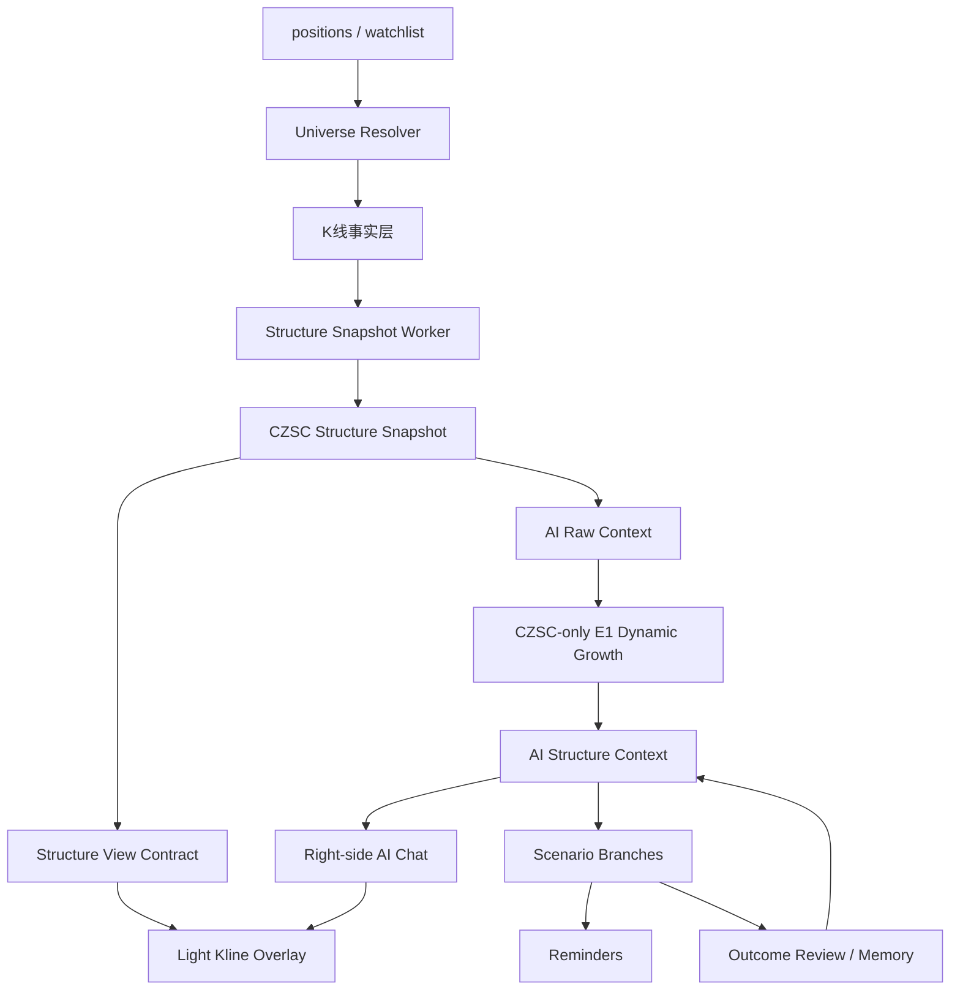

# AI Native V5.0 Optimization Architecture

## 核心判断

AI Native V5.0 不是一次性 AI 解盘，也不是在旧雷达旁边加一个聊天框。

V5.0 的目标是：

> 基于持仓 + watchlist 的股票池，后台自动生成每只票的结构多元宇宙；右侧 AI 问答窗口读取最新结构记忆，回答用户自然问题；K 线图只显示当前回答相关的轻量证据。

E1 / CZSC 推演不是最终 UI 答案，而是后台结构世界模型。用户最终看到的是交易教练式问答。

## 设计原则

- V5.0 结构生产以 CZSC 为唯一主线。
- V5.0 新 API、新 worker、新 AI context、新图表证据、新提醒和新复盘记忆不得依赖旧结构引擎。
- 旧雷达只作为 V4 历史入口存在，不进入 V5.0 数据流，不承担任何兜底、旁路验证或回归验证职责。
- 所有重型计算后台预计算、快照化、缓存化。
- AI 问答不重算结构，只读取最新 `ai_structure_context`。
- K 线图不做复杂多级别嵌套，只做当前回答的视觉证据。
- 每个模块都 Service 化 + API 化，方便 Web、小程序、提醒、复盘、扫描复用。
- E1 背景推演不直接展示为最终答案，只作为右侧问答窗口的结构上下文。
- 不执行交易，只记录、纠正、提醒；涉及操作必须带“仅供参考，不构成投资建议”。

## 整体数据流



## 模块 1：Universe Resolver

职责：确定每天 / 每周期要跑哪些股票。

股票来源：

- 持仓股 `positions`
- 自选股 `watchlist_items`
- 手动 pin / 最近聊天过的股票
- 后续 discovery 候选

Service:

```python
resolve_ai_native_universe(user_id, sources=["positions", "recent_chat", "watchlist"])
```

API:

```http
GET /api/ai-native/universe?sources=positions,watchlist
```

返回：

```json
{
  "symbols": [
    {
      "symbol": "sh.600118",
      "name": "中国卫星",
      "sources": ["watchlist"],
      "priority": 60,
      "has_position": false
    }
  ]
}
```

优先级建议：

- 手动 pin：`120`
- 持仓 + 自选：`110`
- 持仓：`100`
- 最近聊过：`80`
- 自选：`60`

## 模块 2：Market Data Layer

职责：只负责 K 线事实。

现有对应：

- `server/db/kline_lake.py`
- 腾讯行情 HTTP API
- BaoStock lake / QMT lake / TDX lake 只作为 K 线事实源接入，不承担结构判断职责

数据源约束：

- Market Data Layer 只输出原始 K 线和价格事实。
- 不同数据源不得在同一次 CZSC snapshot 中混用。
- 数据源降级只允许在 K 线事实层发生，不能把任何旧结构输出作为补偿。

输出：

- K 线
- 最新价
- 数据更新时间

不做：

- 不算中枢
- 不调用 AI
- 不生成建议

## 模块 3：Structure Snapshot Layer

职责：从 K 线生成结构快照，缓存结果，避免页面请求时重算。

主线：

- CZSC 是 V5.0 唯一结构生产来源。
- V5.0 不保留旧结构引擎兜底，不做旧结构验证，不通过旧 radar 补齐结构字段。
- 旧系统可以继续服务 V4 历史页面，但它的输出不得写入 V5.0 snapshot、AI context、scenario branch、chart evidence、reminder 或 memory。

Service:

```python
enqueue_structure_snapshot_job(symbol, levels=["week", "day", "30", "5"])
get_latest_structure_snapshot(symbol)
get_structure_snapshot_status(symbol)
```

API:

```http
POST /api/ai-structure/snapshots/prewarm
GET /api/ai-structure/snapshots/latest/{symbol}
GET /api/ai-structure/snapshots/status/{symbol}
```

API 约束：

- `prewarm` 只负责入队，不在请求内同步计算结构。
- `latest` 只读最新快照，不触发重算。
- `status` 返回 `fresh` / `stale` / `pending` / `failed` / `no_data` / `degraded`。
- 页面、AI chat、提醒系统都只能读取快照或状态，不能直接调用重型结构计算。

`degraded` 语义：

- `degraded` 只表示 CZSC 输入缺失、级别不足、部分级别计算失败，或暂时使用上一版 CZSC snapshot。
- `degraded` 禁止表示“用旧结构引擎补齐”。
- 任何旧结构输出都不得写入 V5 snapshot，也不得参与 V5 evidence、context、branch、reminder 或 memory。

Snapshot key:

```text
symbol + level + engine + engine_version + adapter_version + data_signature + compute_profile
```

其中 `engine` 在 V5.0 中固定为 `czsc`。V5 表、API、worker 不接受其他 engine 值。

保存内容：

- `klines`
- `bis`
- `zhongshus`
- `active_center`
- `last_close`
- `data_as_of`
- `raw_bi_context`

## 模块 4：Structure View Contract

职责：给 K 线图和 AI 证据共用一份轻量结构视图，保证“AI 说的”和“图上画的”一致。

前端不要直接猜 CZSC 字段。

示例：

```json
{
  "symbol": "sh.688256",
  "level": "5",
  "as_of": "2026-05-12 15:00:00",
  "klines": [],
  "overlays": {
    "active_center": {
      "evidence_id": "ev_center_5m_active",
      "source_snapshot_id": "czsc_snapshot_123",
      "source_context_id": 123,
      "zg": 1268.3,
      "zd": 1250.0,
      "begin_time": "2026-05-12 10:50:00",
      "end_time": "2026-05-12 14:05:00",
      "label": "5分钟中枢"
    },
    "lines": [
      {
        "evidence_id": "ev_trigger_12683",
        "source_snapshot_id": "czsc_snapshot_123",
        "source_context_id": 123,
        "price": 1268.3,
        "label": "突破观察",
        "role": "trigger",
        "reason": "AI 回答引用的上沿触发边界"
      },
      {
        "evidence_id": "ev_invalid_12500",
        "source_snapshot_id": "czsc_snapshot_123",
        "source_context_id": 123,
        "price": 1250.0,
        "label": "失败线",
        "role": "invalidation",
        "reason": "AI 回答引用的结构失效边界"
      }
    ]
  }
}
```

API:

```http
GET /api/ai-structure/chart-context/{symbol}?level=5&context_id=123
```

Evidence Contract:

- 每个中枢、触发线、失败线、当前价线都必须有稳定 `evidence_id`。
- `evidence_id` 格式：`{snapshot_id}:{level}:{evidence_type}:{semantic_key}`。
- AI Chat 返回的 `chart_focus.evidence_ids` 必须能在 chart context 的 `overlays` 中找到。
- AI Chat 返回的 `snapshot_id`、`context_id`、`evidence_ids` 必须同源校验，不允许跨 snapshot/context 拼接证据。
- 图表只渲染当前回答相关 evidence，不自动展开全量结构。
- 如果 evidence 对应的 snapshot 已 stale，chart context 必须返回 `stale=true` 和 `stale_reason`。

## 模块 5：AI Structure Context Layer

职责：把结构事实变成 AI 问答可用的背景世界模型。

输入：

- structure snapshot
- raw BI context
- 用户持仓上下文
- 背景上下文：基本面、板块、资金流、大盘环境

使用：

- `ai_structure_reasoning.e1_dynamic_growth`

E1 约束：

- E1 是 CZSC snapshot 的纯下游 reasoning layer，不是第二结构引擎。
- E1 只能消费 CZSC snapshot、CZSC raw BI context、用户持仓上下文、背景上下文和用户长期记忆。
- E1 禁止调用旧 radar、旧 matrix、旧结构服务、旧结构缓存或历史结构验证逻辑。
- E1 输出只能作为 AI Structure Context，不得反向覆盖 CZSC snapshot。
- 背景上下文只能作为 `context_only`，不得覆盖 `decision_boundary`。
- 当基本面/资金/板块背景与 CZSC 结构边界冲突时，纪律优先，结构触发线和失败线优先。

输出：

- 主推演级别
- 触发级别
- 走势如何生长
- 关键边界
- 分支假设
- 背景摘要

Background Contract:

```json
{
  "background": {
    "fundamental": {
      "status": "available",
      "role": "context_only",
      "verdict": "支持",
      "summary": "长期背景较强，但短线仍需结构确认"
    },
    "market": {
      "fund_flow": {},
      "sector_context": {},
      "index_background": {}
    },
    "rules": {
      "structure_source": "czsc_snapshot_only",
      "background_role": "context_only",
      "structure_role": "decision_boundary",
      "conflict_policy": "structure_discipline_first",
      "no_direct_trade_instruction": true
    }
  }
}
```

关键规则：

- 背景层可以解释“为什么这只票值得观察”，但不能回答“所以可以买”。
- Chat 引用背景时必须回到 CZSC 触发线、失败线、当前价线和提醒条件。
- 基本面较强但结构未触发时，只能回答“继续等待结构确认”。
- 基本面较强但结构失效时，必须优先提示纪律复核，不能用故事替代失败线。
- 背景层不进入雷达状态、结构流水线状态、Kline 证据层或提醒触发条件；雷达只呈现 CZSC 结构事实。
- 如需展示基本面，应放在单票背景/Profile 或 AI 回答的轻量引用中，不能作为“结构强弱”的视觉信号。
- 基本面/板块/资金流更适合未来的选股、仓位背景、观察池分层，不纳入当前 P1 雷达和右侧工作台实现。

Service:

```python
enqueue_ai_structure_context_job(symbol, user_id)
get_latest_ai_structure_context(symbol, user_id)
get_ai_structure_context_status(symbol, user_id)
```

API:

```http
POST /api/ai-structure/contexts/prewarm
GET /api/ai-structure/contexts/latest/{symbol}
GET /api/ai-structure/contexts/status/{symbol}
```

注意：E1 输出不是最终用户答案，是 Ask Layer 的背景。

API 约束：

- `prewarm` 只入队，不同步调用 LLM 或重算结构。
- `latest` 必须校验 `user_id`，只能读取当前用户自己的 context。
- 如果结构快照 stale，返回 stale 状态和可用的上一版 context，由前端提示“结构待刷新”。

## 模块 6：Scenario Branch Layer

职责：管理每只票的“多元宇宙分支”。

每个分支包含：

- `user_id`
- `context_id`
- 当前结构状态
- 主推演级别
- 触发级别
- 触发条件
- 失效条件
- 下一次观察点
- 空仓 / 持仓含义
- 状态：`pending` / `triggered` / `invalidated` / `settled`

Service:

```python
list_scenario_branches(context_id)
settle_scenario_branches(symbol)
```

API:

```http
GET /api/ai-structure/branches/{symbol}
POST /api/ai-structure/branches/settle
```

长期用途：

- 趋势分支追踪
- 提醒
- 复盘
- 单票结构性格统计

## 模块 7：Right-side AI Chat Layer

职责：类似 Codex 的右侧问答窗口。

用户问题例子：

- 现在能买了吗？
- 持有要不要卖？
- 跌破哪里作废？
- 这是趋势票吗？
- 明天高开怎么办？
- 帮我盯着这个价。

Service:

```python
answer_structure_question(symbol, question, user_id, position_context=None)
```

API:

```http
POST /api/ai-structure/chat
GET /api/ai-structure/chat/sessions/{symbol}
GET /api/ai-structure/chat/messages?session_id=...
```

输入：

```json
{
  "symbol": "sh.600118",
  "question": "那我现在能买了吗？",
  "context_id": 123
}
```

返回：

```json
{
  "answer": "...",
  "intent_type": "buy_window",
  "coach_answer": "...",
  "referenced_boundaries": [],
  "chart_focus": {
    "level": "5",
    "snapshot_id": "czsc_snapshot_123",
    "evidence_ids": ["ev_trigger_11483", "ev_invalid_11154"],
    "prices": [114.83, 111.54]
  },
  "suggested_reminders": [],
  "risk_disclaimer": "仅供参考，不构成投资建议"
}
```

要求：

- 回答用户问题，不堆完整结构报告。
- 引用最新 AI Structure Context。
- 支持同一只票连续追问，后续问题默认继承同一个 chat session 的 symbol、context 和最近 evidence。
- 区分空仓、持仓、重仓、成本。
- 输出 chart focus，让 K 线图高亮对应证据。
- 不重新计算结构。
- 不直接给交易指令，只给条件化观察、风险边界和提醒建议。
- 每次回答必须包含“仅供参考，不构成投资建议”。
- 意图识别至少覆盖：`buy_window` / `hold_or_exit` / `invalidation` / `reminder` / `explain_structure` / `review`。
- 无法确认的问题必须明确说“不足以判断”，并给出需要等待的结构条件或数据刷新状态。
- 可以引用基本面/板块/资金流背景，但必须声明背景层不能替代 CZSC 触发线和失败线。
- 右侧 AI Chat 不应把基本面做成雷达卡片或结构状态卡；它只能在回答中作为一句背景说明出现。
- 当 context 已 stale 时，Chat 可以使用上一版结构继续回答，但必须声明“结构快照待刷新，当前基于上一版数据”，并返回 `data_status`。
- 当用户询问目标价、荐股、收益预测、基本面买卖结论时，Chat 必须归类为 `out_of_scope`，不生成提醒候选，只把回答拉回 CZSC 条件边界。

Answer Policy:

- 禁止把“买入 / 卖出 / 加仓 / 清仓”作为直接结论。
- 禁止使用祈使句式交易动作，例如“现在买”“马上卖”“加到几成”。
- 必须输出“条件 / 风险 / 等待信号 / 提醒建议”四类信息中的至少两类。
- 可以回答“如果站上 X 且回踩不破，才进入观察窗口”，不能回答“可以买”。
- `risk_disclaimer` 是 API 必填字段，由 server-side guardrail 注入，不能只依赖 LLM 生成。

## 模块 8：Chart View Layer

职责：K 线只做视觉证据，不做复杂缠论软件。

默认显示：

- 当前回答相关级别
- 最近 K 线
- active center
- trigger line
- invalidation line
- 当前价线

默认不显示：

- 多级别嵌套
- 所有笔
- 所有线段
- 所有买卖点
- 复杂结构 JSON

高级内容放“证据抽屉”。

## 模块 9：Reminder Layer

职责：把 AI 分支或用户问答转提醒。

例子：

- “站上 114.83 提醒我”
- “跌破 111.54 提醒我”
- “5 分钟回踩不破后提醒我”

Service:

```python
create_reminder_from_branch(branch_id, user_id)
create_reminder_from_chat_evidence(session_id, evidence_id, user_id)
```

API:

```http
POST /api/ai-structure/reminders
```

不下单，只提醒。

落地约束：

- AI reminder 不新建孤岛提醒体系，必须写入现有 `alerts`。
- 同时写入 `coach_events`，记录来源 chat/session/branch/evidence，便于去重、追踪和复盘。
- reminder 必须保存 `context_id`、`branch_id`、`evidence_ids`、触发方向、触发价格、过期时间。
- reminder 去重键：`user_id + symbol + context_id + evidence_id + trigger_price + direction`。
- 创建提醒前必须把“提醒，不下单；仅供参考，不构成投资建议”展示给用户。

## 模块 10：Outcome / Memory Layer

职责：自动复盘分支，形成长期记忆。

保存：

- 哪个分支触发
- 哪个分支失效
- 哪个分支过期
- AI 判断是否过早
- 用户是否按计划执行
- 类似结构历史表现

Service:

```python
settle_context_outcomes(symbol)
get_symbol_memory_profile(symbol)
```

API:

```http
POST /api/ai-structure/branches/settle
GET /api/ai-structure/memory/{symbol}
GET /api/ai-structure/outcomes/{symbol}
```

长期目标：

- 每只票形成自己的结构性格
- 围绕少数熟票做长期波段
- 系统知道哪些结构在这只票上胜率更高

结算规则：

- `triggered`：触发条件在对应级别收盘或实时价确认后成立。
- `invalidated`：失效条件成立，且和 branch 的 `invalidate_condition` 一致。
- `expired`：在 `settlement_window` 内既未触发也未失效。
- `settlement_window` 至少支持 `same_day` / `next_day` / `3d` / `5d` / `bars:N`。
- `outcome_score` 记录分支质量，区分“方向正确但过早”“边界正确但触发太宽”“完全失效”。
- `user_followed_plan` 记录用户是否按提醒或计划执行，用于交易纪律记忆。
- outcome review API 返回 user-scoped timeline，并带上 branch contract、mistake 标记和 memory 摘要，供 Web、小程序、复盘页复用。

## 建议数据库表

### `ai_structure_contexts`

```text
id
user_id
symbol
generated_at
data_as_of
engine_version
prompt_version
raw_context_json
background_json
boundary_json
summary_text
status
stale_reason
source_snapshot_ids_json
```

### `structure_snapshots`

```text
id
symbol
level
engine
engine_version
adapter_version
compute_profile
data_signature
data_as_of
snapshot_json
raw_bi_context_json
structure_fingerprint
status
error_code
error_message
created_at
updated_at
```

### `structure_snapshot_jobs`

```text
id
job_id
symbol
level
engine
compute_profile
data_signature
priority
status
reason
requested_by_user_id
retry_count
next_run_at
locked_by
locked_at
error_code
error_message
created_at
updated_at
```

### `scenario_branches`

```text
id
user_id
context_id
symbol
main_level
trigger_level
branch_type
current_state
trigger_condition
invalidate_condition
next_recheck
status
source_context_version
evidence_refs_json
created_at
updated_at
```

### `scenario_outcomes`

```text
id
user_id
branch_id
checked_at
outcome
outcome_score
settlement_window
triggered_price
invalidated_price
expired_at
user_followed_plan
notes
```

### `ai_structure_chat_sessions`

```text
id
user_id
symbol
latest_context_id
status
created_at
updated_at
```

### `ai_structure_chat_messages`

```text
id
session_id
user_id
symbol
context_id
role
question_text
intent_type
answer_json
evidence_refs_json
reminder_candidates_json
risk_disclaimer
created_at
```

### `ai_symbol_memory_profiles`

```text
id
user_id
symbol
updated_at
profile_json
stats_json
```

## V4 旧雷达隔离策略

### Phase 1：V5 独立启动

- V5 默认运行态不注册旧 `/api/radar`、旧 `/api/chan`、旧 `/api/agent`、旧 `/api/scan`、旧 `/api/playbook`、旧 `/api/rotation`、旧 `/api/sand-table`、旧 `/api/structure`。
- 不提供 `ENABLE_LEGACY_CHAN_RADAR` 之类的运行时开关，避免旧架构被环境变量重新打开。
- 新增 `/api/ai-structure/*`，V5 结构、上下文、问答、图表证据、提醒和复盘统一收敛在这一组 API 下。
- V5 新页面、新问答、新提醒、新复盘只读 CZSC snapshot 和 AI Structure Context。
- V5 不从旧 `/api/radar`、旧 matrix、旧结构服务读取任何结构字段。

### Phase 2：V5 默认展示

- 前端读 V5 snapshot。
- 图表读 chart context。
- 右侧 AI 窗口读 latest context。
- 如果 V5 snapshot 缺失或 stale，页面显示等待刷新 / 使用上一版快照，不回退到旧雷达。
- 右侧 AI 工作台用轻量状态条区分 `stale`、`no_data`、`failed`、`pending`：缺 K 线时提示先同步数据，CZSC 不可用时提示检查 worker / 依赖，stale 时明确“基于上一版结构”，生成中时明确页面请求不会同步跑重型结构计算。

### Phase 3：旧实时结构计算退出产品主线

- V5 页面请求不触发任何重型结构计算。
- 旧实时结构计算不再拥有产品入口、默认 worker 入口或前端入口。
- 如需查看历史实现，只能作为待删除代码阅读，不得被 V5 worker、API、测试或自动回归流程调用。
- 删除 V5 路径中所有旧结构读取、旧 radar 读取和重复结构计算入口。
- 删除旧前端雷达/Kline/chan/scanner/AI 训练报告入口。
- 删除旧 API router 注册和 legacy runtime switch。
- 物理删除旧 `chan.py` adapter、旧 scanner/rotation/playbook/sand-table/multiverse API、旧 structure job queue、旧 AI Native V1/V4 fusion/agent/observation/stop-reduce 训练链路。
- V5 不保留 fallback / shadow / comparison 入口。
- 新增 `tests/test_ai_structure_no_legacy_calls.py` 与 `tests/test_ai_structure_runtime_isolation.py`，守住 import graph、router、worker、前端默认包边界。

## 第一阶段验收标准

不用做漂亮 UI，先跑通底层闭环：

```text
给一个 user_id
→ 从 positions + watchlist 拿 symbol universe
→ Structure Snapshot Job 入队
→ CZSC Snapshot Worker 异步生成 structure snapshot
→ AI Structure Context Job 入队
→ AI Structure Context Worker 异步生成用户态 context
→ 保存 context + branches
→ latest/status API 可读取 fresh/stale/pending/failed 状态
→ chart context API 可按 evidence_id 读取轻量证据
→ chat API 只读 context，回答“现在能买了吗”
→ chat 返回 evidence_ids 和 reminder candidates
```

## 推荐第一批动工文件

- `server/engines/ai_native/universe_resolver.py`
- `server/engines/ai_native/structure_context_service.py`
- `server/engines/ai_native/scenario_branch_service.py`
- `server/engines/ai_native/structure_chat_service.py`
- `server/api/ai_structure.py`
- `server/db/database.py` 增加 schema
- `tests/test_ai_structure_universe.py`
- `tests/test_ai_structure_context_service.py`
- `tests/test_ai_structure_chat_api.py`
- `tests/test_ai_structure_chart_context.py`
- `tests/test_ai_structure_reminder_bridge.py`
- `tests/test_ai_structure_outcome_settlement.py`
- `tests/test_ai_structure_auth_isolation.py`
- `tests/test_ai_structure_no_legacy_calls.py`
- `tests/test_ai_structure_stale_status.py`

## 关键风险

- 不要让请求路径重算结构。
- 不要让 AI 问答直接访问复杂 CZSC 对象。
- 不要让图表和 AI 用两份不同结构数据。
- 不要让 V5 任何路径回退到旧雷达或旧结构引擎。
- 不要把 E1 背景当最终回答。
- 不要一开始做复杂 UI，先做 API 闭环。
- 不要让提醒、聊天、复盘各自保存一份不同的边界价格。

## API 鉴权与隔离

- `structure_snapshots` 可以按 symbol 共享，但只能保存市场结构事实，不得包含用户持仓、成本、聊天内容或个人策略。
- `ai_structure_contexts`、`scenario_branches`、`scenario_outcomes`、`ai_symbol_memory_profiles`、chat messages、reminders 必须全部带 `user_id`。
- 所有 `context_id`、`branch_id`、`reminder_id` 查询必须校验归属用户。
- 后台 worker 可以批量处理 symbol，但写入用户态 context / branch / memory 时必须按 user_id 拆分。
- 所有用户态 API 的 `user_id` 必须从 auth context 注入，禁止 body/query 覆盖。
- 跨用户读取 `context_id`、`branch_id`、`session_id`、`message_id`、`reminder_id` 固定返回 `404`，避免泄漏资源存在性。
- 权限不足但资源不属于当前用户时不返回部分字段，不返回 symbol/name/context 元数据。
- contract tests 必须覆盖 user 隔离、stale 状态、evidence lookup、chat 不重算结构、V5 不调用旧 radar。

## 闭环任务

后台任务按以下顺序串联：

```text
positions / watchlist 变化
→ Universe Resolver 生成用户股票池
→ Kline Sync 补齐 CZSC 所需 K 线
→ Structure Snapshot Job 入队
→ CZSC Snapshot Worker 生成结构快照
→ AI Structure Context Worker 生成用户态上下文
→ Scenario Branch Worker 生成多元宇宙分支
→ Reminder Worker 监听触发 / 失效条件
→ Outcome Worker 结算分支
→ Memory Worker 更新单票长期记忆
```

每个 worker 都必须可重试、可跳过 stale 输入、可记录 error_code，并且不能在用户页面请求内同步执行。

Worker Contract:

- 每类 job 必须有 idempotency key。
- Snapshot job key: `symbol + level + engine + data_signature + compute_profile`。
- Context job key: `user_id + symbol + source_snapshot_ids + prompt_version`。
- Branch job key: `user_id + context_id + branch_type + trigger_condition + invalidate_condition`。
- Reminder job key: `user_id + symbol + context_id + evidence_id + trigger_price + direction`。
- Outcome job key: `user_id + branch_id + settlement_window + checked_at_date`。
- 状态流转统一为 `PENDING` / `RUNNING` / `SUCCESS` / `SKIPPED` / `FAILED_RETRYABLE` / `FAILED_FINAL`。
- stale 输入默认 `SKIPPED` 并记录 `stale_reason`，不得自行触发同步重算。
- 每个 job 必须有 retry 上限，失败原因写入 `error_code` / `error_message`。

## 后置优化

- 任务优先级限流：持仓 > 最近聊过 > watchlist；pin / discovery 候选后续再进入优先级队列。
- 增加 AI 降级模板：当数据不足、结构 stale、问题超出产品边界时，必须拒绝直接判断并返回等待条件。

## 最终产品形态

左侧：

- 简单 K 线
- 当前相关中枢
- 触发线
- 失败线

右侧：

- AI 问答窗口
- 最新结构背景
- 用户自然提问
- 可转提醒
- 可追踪分支

底层：

- 每只票每天自动生成结构多元宇宙
- 长期沉淀单票结构记忆
- 围绕少数熟票做长期波段，提高胜率
