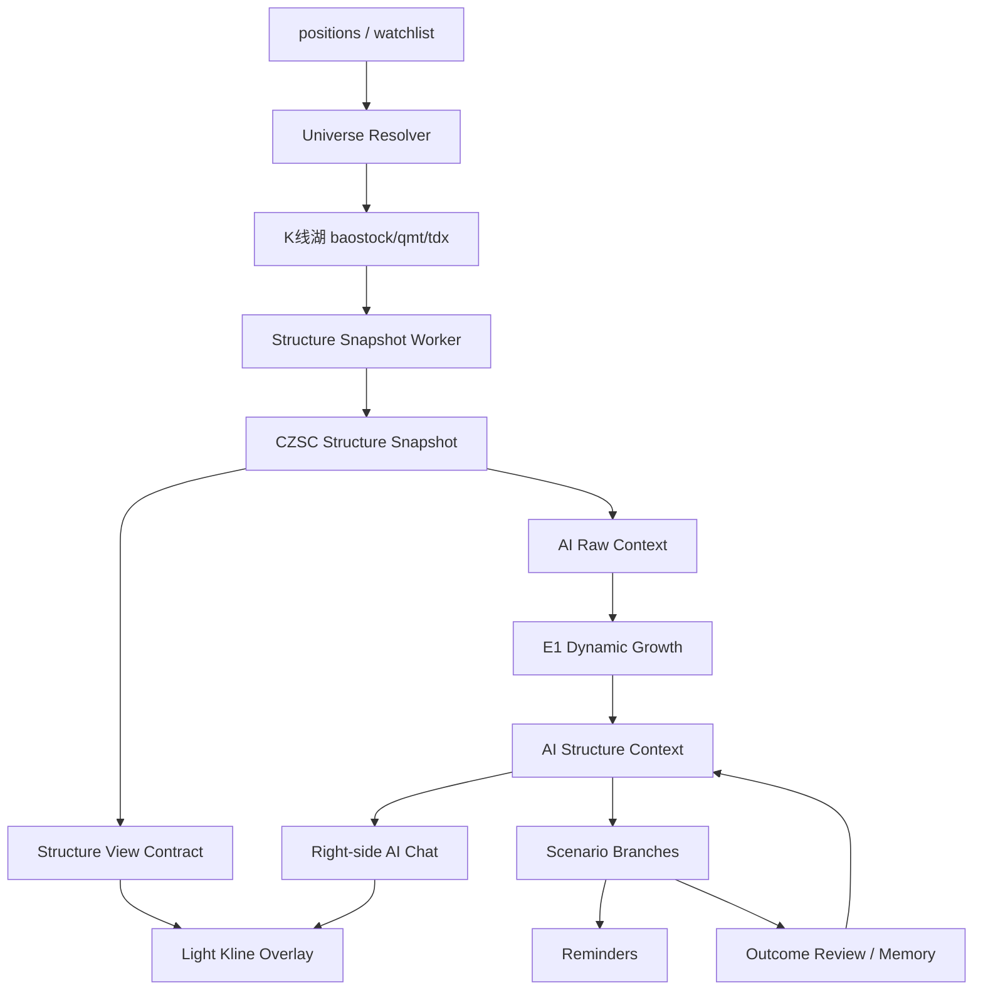

# AI Native V5.0 Optimization Architecture

## 核心判断

AI Native V5.0 不是一次性 AI 解盘，也不是在旧雷达旁边加一个聊天框。

V5.0 的目标是：

> 基于持仓 + watchlist 的股票池，后台自动生成每只票的结构多元宇宙；右侧 AI 问答窗口读取最新结构记忆，回答用户自然问题；K 线图只显示当前回答相关的轻量证据。

E1 / CZSC 推演不是最终 UI 答案，而是后台结构世界模型。用户最终看到的是交易教练式问答。

## 设计原则

- 旧雷达结构计算退出主请求路径，避免打开页面时重算慢结构。
- CZSC 作为 V5.0 结构生产主线，`chan.py` 暂作 fallback / shadow / 回归对照。
- 所有重型计算后台预计算、快照化、缓存化。
- AI 问答不重算结构，只读取最新 `ai_structure_context`。
- K 线图不做复杂多级别嵌套，只做当前回答的视觉证据。
- 每个模块都 Service 化 + API 化，方便 Web、小程序、提醒、复盘、扫描复用。
- E1 背景推演不直接展示为最终答案，只作为右侧问答窗口的结构上下文。
- 不执行交易，只记录、纠正、提醒；涉及操作必须带“仅供参考，不构成投资建议”。

## 整体数据流



## 模块 1：Universe Resolver

职责：确定每天 / 每周期要跑哪些股票。

股票来源：

- 持仓股 `positions`
- 自选股 `watchlist_items`
- 手动 pin / 最近聊天过的股票
- 后续 scanner 候选

Service:

```python
resolve_ai_native_universe(user_id, sources=["positions", "watchlist"])
```

API:

```http
GET /api/ai-native/universe?sources=positions,watchlist
```

返回：

```json
{
  "symbols": [
    {
      "symbol": "sh.600118",
      "name": "中国卫星",
      "sources": ["watchlist"],
      "priority": 60,
      "has_position": false
    }
  ]
}
```

优先级建议：

- 手动 pin：`120`
- 持仓 + 自选：`110`
- 持仓：`100`
- 最近聊过：`80`
- 自选：`60`

## 模块 2：Market Data Layer

职责：只负责 K 线事实。

现有对应：

- `server/db/kline_lake.py`
- BaoStock lake
- QMT lake
- TDX lake

输出：

- K 线
- 最新价
- 数据更新时间

不做：

- 不算中枢
- 不调用 AI
- 不生成建议

## 模块 3：Structure Snapshot Layer

职责：从 K 线生成结构快照，缓存结果，避免页面请求时重算。

主线：

- CZSC

保留：

- `chan.py` fallback / 对照 / 旧接口兼容

Service:

```python
generate_structure_snapshot(symbol, levels=["week", "day", "30", "5"])
get_latest_structure_snapshot(symbol)
```

API:

```http
POST /api/structure-v2/snapshots/generate
GET /api/structure-v2/snapshots/latest/{symbol}
```

Snapshot key:

```text
symbol + level + engine + data_as_of + compute_profile
```

保存内容：

- `klines`
- `bis`
- `zhongshus`
- `active_center`
- `last_close`
- `data_as_of`
- `raw_bi_context`

## 模块 4：Structure View Contract

职责：给 K 线图和 AI 证据共用一份轻量结构视图，保证“AI 说的”和“图上画的”一致。

前端不要直接猜 CZSC 字段。

示例：

```json
{
  "symbol": "sh.688256",
  "level": "5",
  "as_of": "2026-05-12 15:00:00",
  "klines": [],
  "overlays": {
    "active_center": {
      "zg": 1268.3,
      "zd": 1250.0,
      "begin_time": "2026-05-12 10:50:00",
      "end_time": "2026-05-12 14:05:00",
      "label": "5分钟中枢"
    },
    "lines": [
      {
        "price": 1268.3,
        "label": "突破观察",
        "role": "trigger"
      },
      {
        "price": 1250.0,
        "label": "失败线",
        "role": "invalidation"
      }
    ]
  }
}
```

API:

```http
GET /api/radar-v2/chart-context/{symbol}?level=5&context_id=123
```

## 模块 5：AI Structure Context Layer

职责：把结构事实变成 AI 问答可用的背景世界模型。

输入：

- structure snapshot
- raw BI context
- 用户持仓上下文

使用：

- `ai_chan_reasoning.e1_dynamic_growth`

输出：

- 主推演级别
- 触发级别
- 走势如何生长
- 关键边界
- 分支假设
- 背景摘要

Service:

```python
generate_ai_structure_context(symbol, user_id)
get_latest_ai_structure_context(symbol, user_id)
```

API:

```http
POST /api/ai-structure/contexts/generate
GET /api/ai-structure/contexts/latest/{symbol}
```

注意：E1 输出不是最终用户答案，是 Ask Layer 的背景。

## 模块 6：Scenario Branch Layer

职责：管理每只票的“多元宇宙分支”。

每个分支包含：

- 当前结构状态
- 主推演级别
- 触发级别
- 触发条件
- 失效条件
- 下一次观察点
- 空仓 / 持仓含义
- 状态：`pending` / `triggered` / `invalidated` / `settled`

Service:

```python
list_scenario_branches(context_id)
settle_scenario_branches(symbol)
```

API:

```http
GET /api/ai-structure/branches/{symbol}
POST /api/ai-structure/branches/settle
```

长期用途：

- 趋势分支追踪
- 提醒
- 复盘
- 单票结构性格统计

## 模块 7：Right-side AI Chat Layer

职责：类似 Codex 的右侧问答窗口。

用户问题例子：

- 现在能买了吗？
- 持有要不要卖？
- 跌破哪里作废？
- 这是趋势票吗？
- 明天高开怎么办？
- 帮我盯着这个价。

Service:

```python
answer_structure_question(symbol, question, user_id, position_context=None)
```

API:

```http
POST /api/ai-structure/chat
```

输入：

```json
{
  "symbol": "sh.600118",
  "question": "那我现在能买了吗？",
  "context_id": 123
}
```

返回：

```json
{
  "answer": "...",
  "referenced_boundaries": [],
  "chart_focus": {
    "level": "5",
    "prices": [114.83, 111.54]
  },
  "suggested_reminders": []
}
```

要求：

- 回答用户问题，不堆完整结构报告。
- 引用最新 AI Structure Context。
- 区分空仓、持仓、重仓、成本。
- 输出 chart focus，让 K 线图高亮对应证据。
- 不重新计算结构。

## 模块 8：Chart View Layer

职责：K 线只做视觉证据，不做复杂缠论软件。

默认显示：

- 当前回答相关级别
- 最近 K 线
- active center
- trigger line
- invalidation line
- 当前价线

默认不显示：

- 多级别嵌套
- 所有笔
- 所有线段
- 所有买卖点
- 复杂结构 JSON

高级内容放“证据抽屉”。

## 模块 9：Reminder Layer

职责：把 AI 分支或用户问答转提醒。

例子：

- “站上 114.83 提醒我”
- “跌破 111.54 提醒我”
- “5 分钟回踩不破后提醒我”

Service:

```python
create_reminder_from_branch(branch_id, user_id)
```

API:

```http
POST /api/ai-structure/reminders
```

不下单，只提醒。

## 模块 10：Outcome / Memory Layer

职责：自动复盘分支，形成长期记忆。

保存：

- 哪个分支触发
- 哪个分支失效
- AI 判断是否过早
- 用户是否按计划执行
- 类似结构历史表现

Service:

```python
settle_context_outcomes(symbol)
get_symbol_memory_profile(symbol)
```

API:

```http
POST /api/ai-structure/outcomes/settle
GET /api/ai-structure/memory/{symbol}
```

长期目标：

- 每只票形成自己的结构性格
- 围绕少数熟票做长期波段
- 系统知道哪些结构在这只票上胜率更高

## 建议数据库表

### `ai_structure_contexts`

```text
id
user_id
symbol
generated_at
data_as_of
engine_version
prompt_version
raw_context_json
background_json
boundary_json
summary_text
```

### `scenario_branches`

```text
id
context_id
symbol
main_level
trigger_level
branch_type
current_state
trigger_condition
invalidate_condition
next_recheck
status
```

### `scenario_outcomes`

```text
id
branch_id
checked_at
outcome
triggered_price
notes
```

### `ai_symbol_memory_profiles`

```text
id
user_id
symbol
updated_at
profile_json
stats_json
```

## 重构旧雷达的策略

### Phase 1：旁路新雷达

- 保留旧 `/api/radar`。
- 新增 `/api/radar-v2`。
- 新结构只服务测试股票。
- 不影响现有主路径。

### Phase 2：新雷达默认展示

- 前端雷达读 v2 snapshot。
- 图表读 chart context。
- 右侧 AI 窗口读 latest context。
- 旧雷达 fallback。

### Phase 3：旧实时结构计算下线

- 页面请求不触发重型 `chan.py`。
- 旧结构计算只保留 debug/fallback。
- 删除重复结构计算入口。

## 第一阶段验收标准

不用做漂亮 UI，先跑通底层闭环：

```text
给一个 user_id
→ 从 positions + watchlist 拿 symbol universe
→ 生成 CZSC structure snapshot
→ 生成 AI structure context
→ 保存 context + branches
→ latest context API 可读取
→ chart context API 可读取
→ chat API 回答“现在能买了吗”
```

## 推荐第一批动工文件

- `server/engines/ai_native/universe_resolver.py`
- `server/engines/ai_native/structure_context_service.py`
- `server/engines/ai_native/scenario_branch_service.py`
- `server/engines/ai_native/structure_chat_service.py`
- `server/api/ai_structure.py`
- `server/db/database.py` 增加 schema
- `tests/test_ai_structure_universe.py`
- `tests/test_ai_structure_context_service.py`
- `tests/test_ai_structure_chat_api.py`

## 关键风险

- 不要让请求路径重算结构。
- 不要让 AI 问答直接访问复杂 CZSC 对象。
- 不要让图表和 AI 用两份不同结构数据。
- 不要让旧雷达慢路径继续拖住页面。
- 不要把 E1 背景当最终回答。
- 不要一开始做复杂 UI，先做 API 闭环。

## 最终产品形态

左侧：

- 简单 K 线
- 当前相关中枢
- 触发线
- 失败线

右侧：

- AI 问答窗口
- 最新结构背景
- 用户自然提问
- 可转提醒
- 可追踪分支

底层：

- 每只票每天自动生成结构多元宇宙
- 长期沉淀单票结构记忆
- 围绕少数熟票做长期波段，提高胜率
