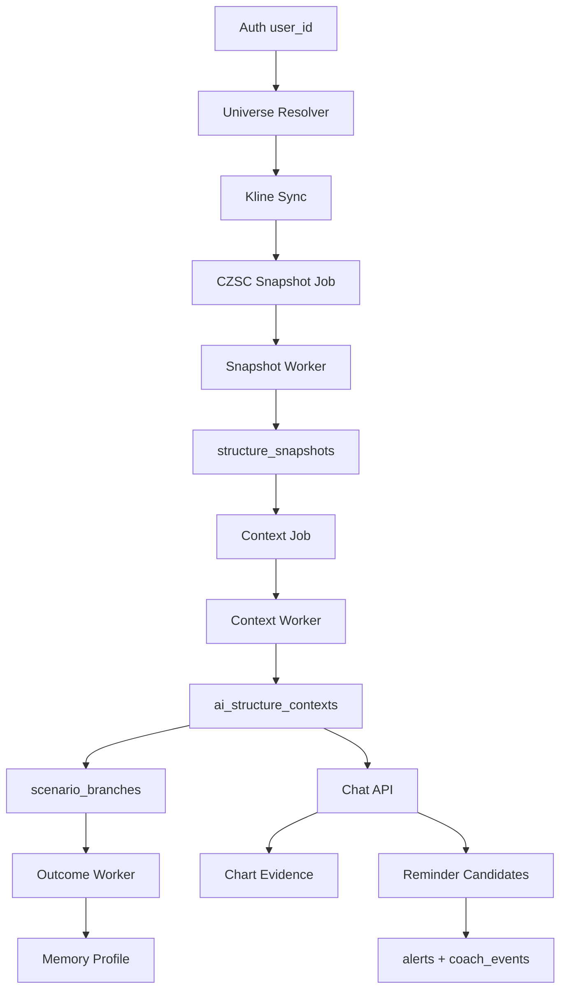

# AI Native V5.0 Phase 1 Engineering Plan

## 结论

建议开工，但只开第一阶段最小闭环，不碰完整 UI。

第一阶段目标：

```text
positions / watchlist
→ CZSC-only snapshot jobs
→ AI Structure Context
→ Scenario Branches
→ Chat answer
→ Chart evidence
→ Reminder candidates
```

所有 V5 代码必须满足：

- `engine = "czsc"` 固定，不支持旧结构引擎。
- 页面请求不重算结构。
- AI Chat 只读 context，不访问 CZSC 对象或旧 radar。
- 所有用户态数据按 `user_id` 隔离。
- 回答只给条件、风险、等待信号、提醒建议，不给直接交易指令。
- 每个回答和提醒都带“仅供参考，不构成投资建议”。

## 当前可复用资产

- `server/engines/structure/czsc_adapter.py`
  - 已能从 K 线 lake 生成 CZSC 结构。
  - 需要调整注释和调用边界：V5 只走 CZSC，不再描述旧路径保护。

- `server/engines/structure/czsc_serializer.py`
  - 已输出 `klines`、`bis`、`zhongshus`、`active_zhongshu`、`price`。
  - 可作为 V5 snapshot payload 的初始 serializer。

- `server/workers/kline_sync_worker.py`
  - 已从 positions/watchlist 收集 symbol，并在 K 线变化后入队结构任务。
  - V5 需要新增 CZSC-only job 入队，不复用旧 `chan` structure key。

- `server/engines/coach/event_log.py`
  - 已有 `coach_events`、`strategy_triggers`、`alert_deliveries` 写入 helper。
  - V5 reminder bridge 应复用它，不新增孤岛提醒日志。

- `server/db/database.py`
  - 已有 `alerts`、`coach_events`、`watchlist_groups`、`watchlist_items`、`positions`。
  - 需要追加 V5 schema。

## PR 切分

### Parallel Track：旧架构拆除计划

新 V5 搭建和旧架构拆除必须并行规划，但不能在 PR1 就大拆旧代码。正确顺序是：先隔离、再观测、再替换、再删除。否则最容易把页面、worker 或提醒系统打断。

#### D0：冻结旧结构扩展

目标：旧架构不再长新功能。

动作：

- 冻结旧结构相关入口的新功能开发。
- V5 代码禁止 import 旧结构 service、旧 radar adapter、旧 matrix contract。
- 给旧结构入口加清晰注释：只服务 V4 历史页面或迁移前兼容。
- 新增 `tests/test_ai_structure_no_legacy_calls.py`，从 PR1 开始守住边界。

验收：

- V5 模块 import graph 中没有旧结构入口。
- V5 API 不调用旧 radar、旧 matrix、旧结构缓存。

#### D1：旧入口移除

目标：V5 默认运行态不再提供旧架构入口。

动作：

- 删除旧前端雷达/Kline/chan/scanner/AI 训练报告入口。
- 删除旧 API router 注册。
- 删除 legacy runtime switch，不允许通过环境变量重新打开旧架构。
- 后台 K 线同步和 scanner 不再入队旧 structure jobs。
- 物理删除旧 `chan.py` adapter、旧 scanner/rotation/playbook/sand-table/multiverse API、旧 structure job queue、旧 AI Native V1/V4 fusion/agent/observation/stop-reduce 训练链路。

验收：

- 默认 app 不注册 `/api/radar`、`/api/chan`、`/api/agent`、`/api/scan`、`/api/playbook`、`/api/rotation`、`/api/sand-table`、`/api/structure`。
- 默认 app 启动后不 import 旧 radar/chan service。
- 前端默认包没有旧 radar/chan 引用。

#### D2：前端读路径切换

目标：V5 页面不再碰旧 radar。

动作：

- 新增 V5 页面或 panel，只调用 `/api/ai-structure/*`。
- 旧 radar UI 从 V5 默认前端包移除，不作为 V5 缺数据兜底。
- V5 stale/no_data/failed 时显示状态，不回退旧图或旧报告。

验收：

- 浏览器网络请求里 V5 页面无 `/api/radar`。
- `no_data/degraded/stale` 状态下也无旧接口请求。

#### D3：worker 读路径切换

目标：提醒、复盘、后台扫描不再从旧结构拿 V5 所需边界。

动作：

- V5 reminder 只读 `scenario_branches` 和 chart evidence。
- V5 outcome 只读 V5 context/branch/snapshot。
- 旧 worker 不在默认运行态启动；旧结构任务不再自动入队。

验收：

- V5 reminder/outcome tests mock 掉旧结构入口后仍通过。
- V5 表中没有来自旧结构的 source/version。

#### D4：旧接口降级为只读历史

目标：旧接口不再参与实时结构计算。

动作：

- 旧接口只读历史快照或返回“legacy unavailable”。
- 禁止旧接口在页面请求内触发重型结构计算。
- 保留数据导出和历史排查能力。

验收：

- 旧接口请求不会触发结构 compute job。
- 旧接口不会写 V5 表。

#### D5：删除旧架构代码

目标：删除前先证明没有调用者。

删除条件：

- 连续两个迭代无生产调用。
- V5 页面、worker、提醒、复盘全部通过 no-legacy tests。
- 历史数据迁移或归档完成。
- 用户确认不再需要 V4 历史页面。

删除顺序：

1. 删除旧前端入口。
2. 删除旧 API router 注册。
3. 删除旧 worker 调用。
4. 删除旧 service。
5. 清理旧测试，只保留迁移归档说明。

暂不删除：

- 旧历史数据表。
- 尚被旧测试覆盖、但不在 V5 app/router/worker/import path 中的历史实现文件。

原因：先保证 V5 运行态和用户入口纯净，再分批删除历史文件和旧测试，避免一次性删除造成不可控回归。

### PR1：CZSC Snapshot Contract

目标：建立 V5 结构快照与异步 job 的底座。

文件：

- `server/db/database.py`
- `server/engines/ai_native/universe_resolver.py`
- `server/engines/ai_native/czsc_snapshot_service.py`
- `server/workers/ai_structure_snapshot_worker.py`
- `server/api/ai_structure.py`
- `tests/test_ai_structure_universe.py`
- `tests/test_ai_structure_snapshot_jobs.py`
- `tests/test_ai_structure_no_legacy_calls.py`
- `tests/test_ai_structure_stale_status.py`

Schema:

- `structure_snapshots`
- `structure_snapshot_jobs`

Key rules:

- Snapshot job idempotency key:
  `symbol + level + engine + data_signature + compute_profile`
- `engine` 固定为 `czsc`。
- `degraded` 只代表 CZSC 输入/级别/计算不完整，不能代表旧结构补齐。
- `latest/status` 只读 DB，不触发重算。

API:

```http
GET /api/ai-native/universe?sources=positions,watchlist
POST /api/ai-structure/snapshots/prewarm
GET /api/ai-structure/snapshots/latest/{symbol}
GET /api/ai-structure/snapshots/status/{symbol}
```

Acceptance:

- watchlist + positions 能解析出 universe。
- prewarm 入队，不同步跑 CZSC。
- worker 可生成 snapshot。
- latest/status 可返回 `fresh/stale/pending/failed/no_data/degraded`。
- 测试证明 V5 snapshot path 不 import / call 旧 radar、旧 matrix、旧结构服务。

### PR2：AI Structure Context + Scenario Branch

目标：把 CZSC snapshot 变成用户态结构上下文和分支。

文件：

- `server/engines/ai_native/structure_context_service.py`
- `server/engines/ai_native/scenario_branch_service.py`
- `server/workers/ai_structure_context_worker.py`
- `server/api/ai_structure.py`
- `tests/test_ai_structure_context_service.py`
- `tests/test_ai_structure_auth_isolation.py`

Schema:

- `ai_structure_contexts`
- `scenario_branches`

Key rules:

- Context job idempotency key:
  `user_id + symbol + source_snapshot_ids + prompt_version`
- Branch job idempotency key:
  `user_id + context_id + branch_type + trigger_condition + invalidate_condition`
- E1 只能消费 CZSC snapshot、CZSC raw BI context、用户持仓上下文、长期记忆。
- E1 输出不能覆盖 snapshot。

API:

```http
POST /api/ai-structure/contexts/prewarm
GET /api/ai-structure/contexts/latest/{symbol}
GET /api/ai-structure/contexts/status/{symbol}
GET /api/ai-structure/branches/{symbol}
```

Acceptance:

- 持仓用户和自选用户生成不同 user-scoped context。
- 跨用户访问 context/branch 返回 `404`。
- stale snapshot 下 context status 正确，不同步重算。

### PR3：Chat + Evidence Contract

目标：让用户能问“现在能买了吗”，并得到条件化回答和图表证据引用。

文件：

- `server/engines/ai_native/structure_chat_service.py`
- `server/engines/ai_native/structure_evidence_service.py`
- `server/api/ai_structure.py`
- `tests/test_ai_structure_chat_api.py`
- `tests/test_ai_structure_chart_context.py`

Schema:

- `ai_structure_chat_sessions`
- `ai_structure_chat_messages`

API:

```http
POST /api/ai-structure/chat
GET /api/ai-structure/chat/sessions/{symbol}
GET /api/ai-structure/chat/messages?session_id=...
GET /api/ai-structure/chart-context/{symbol}?level=5&context_id=...
```

Key rules:

- Chat 只读 latest context。
- Chat 不重算 CZSC、不访问旧 radar。
- `risk_disclaimer` 由 server-side guardrail 注入。
- `evidence_id` 格式：
  `{snapshot_id}:{level}:{evidence_type}:{semantic_key}`
- `snapshot_id/context_id/evidence_ids` 必须同源。

Answer Policy:

- 禁止把“买入 / 卖出 / 加仓 / 清仓”作为直接结论。
- 必须给条件、风险、等待信号、提醒建议中的至少两类。
- 数据不足时回答“不足以判断”，并说明等待条件。

Acceptance:

- 问“我现在能买吗？”返回 `intent_type=buy_window`。
- 返回包含 `chart_focus.evidence_ids`。
- chart context 能找到这些 evidence。
- 回答包含“仅供参考，不构成投资建议”。
- 测试证明 chat path 不重算结构。

### PR4：Reminder Bridge + Outcome / Memory

目标：把 chat / branch 转成提醒候选，并把分支结算进入复盘和记忆。

文件：

- `server/engines/ai_native/structure_reminder_service.py`
- `server/engines/ai_native/scenario_outcome_service.py`
- `server/workers/ai_structure_outcome_worker.py`
- `server/api/ai_structure.py`
- `tests/test_ai_structure_reminder_bridge.py`
- `tests/test_ai_structure_outcome_settlement.py`

Schema:

- `scenario_outcomes`
- `ai_symbol_memory_profiles`

Existing tables reused:

- `alerts`
- `coach_events`
- `strategy_triggers`
- `alert_deliveries`

Reminder dedupe key:

```text
user_id + symbol + context_id + evidence_id + trigger_price + direction
```

Outcome states:

- `triggered`
- `invalidated`
- `expired`

Acceptance:

- reminder 写 `alerts`，同时写 `coach_events`。
- duplicate reminder 不重复创建。
- outcome worker 可按 `same_day/next_day/3d/5d/bars:N` 结算。
- memory profile 更新只影响当前 user_id。

### PR5：Web Thin Slice

目标：只做最小可用体验，不做复杂结构报告页。

范围：

- 右侧 AI chat。
- 左侧轻量 K 线 evidence overlay。
- 状态提示：`pending/stale/failed/no_data/degraded`。
- 一键创建提醒候选。

不做：

- 多级别嵌套。
- 全量笔、线段、买卖点展示。
- 复杂结构报告页。

## 数据流



## Engineering Decisions

1. V5 不复用 `server/api/structure.py` 的 existing router 作为产品入口。
   - 该 router 仍是旧结构调试入口，包含多引擎诊断语义。
   - V5 新入口必须是 `server/api/ai_structure.py`。

2. V5 可以复用 CZSC adapter 的内部函数，但不得复用多引擎 router。
   - 允许：`analyze_czsc_structure_sync`、`export_czsc_raw_bi_context_sync`、serializer。
   - 禁止：任何可切换到旧结构引擎或多引擎比较的入口。

3. V5 snapshot table 独立于旧结构快照表。
   - 避免旧字段名、旧 engine key、旧 worker 语义污染 V5。

4. Auth 先沿用当前 `user_id: int = 1` 兼容模式，但 V5 API 内部必须集中封装 `resolve_current_user_id()`。
   - 后续接真实 auth 时，只替换 resolver。
   - V5 service 不接受外部直接传入覆盖 user_id。

5. 第一阶段优先做 contract tests。
   - 这不是仪式。这里的 bug 会让系统重新退化成结构报告页或旧 radar 旁路。

## Edge Cases

- CZSC package unavailable：snapshot status `failed` 或 `degraded`，不调用旧结构。
- 某级别无 K 线：该级别 `no_data`，整体可 `degraded`。
- K 线数据 signature 变化：旧 snapshot 标记 stale，新 job 入队。
- context 的 source snapshot stale：chat 可以读上一版 context，但必须返回 stale 标记。
- evidence_id 找不到：chat response 视为 invalid，server 返回 guarded error，不给裸答案。
- 用户跨账号访问 context/session/branch/reminder：固定 `404`。
- LLM 超时：chat 返回“AI 服务忙，请稍后重试”，不重算结构，不生成提醒。
- 用户问直接交易指令：按 Answer Policy 转成条件化回答。

## Test Gate

第一阶段合并前必须通过：

```bash
pytest tests/test_ai_structure_universe.py -v
pytest tests/test_ai_structure_snapshot_jobs.py -v
pytest tests/test_ai_structure_context_service.py -v
pytest tests/test_ai_structure_chat_api.py -v
pytest tests/test_ai_structure_chart_context.py -v
pytest tests/test_ai_structure_reminder_bridge.py -v
pytest tests/test_ai_structure_outcome_settlement.py -v
pytest tests/test_ai_structure_auth_isolation.py -v
pytest tests/test_ai_structure_no_legacy_calls.py -v
pytest tests/test_ai_structure_stale_status.py -v
```

## Open Questions

1. `engine_version` 是否跟 CZSC package version 绑定，还是跟 adapter serializer version 绑定？
   - 推荐：两个都存，`engine_version=czsc.__version__`，`adapter_version=czsc_adapter.vN`。

2. V5 第一阶段是否需要真实 LLM？
   - 推荐：先允许 deterministic fake LLM / injected LLM service 跑 contract tests，再接真实 DeepSeek。

3. 是否立即替换 watchlist 新增后的旧 structure job 入队？
   - 推荐：PR1 只新增 V5 入队，不删除旧入队；V5 API 不读取旧 job。后续单独清理旧路径。
