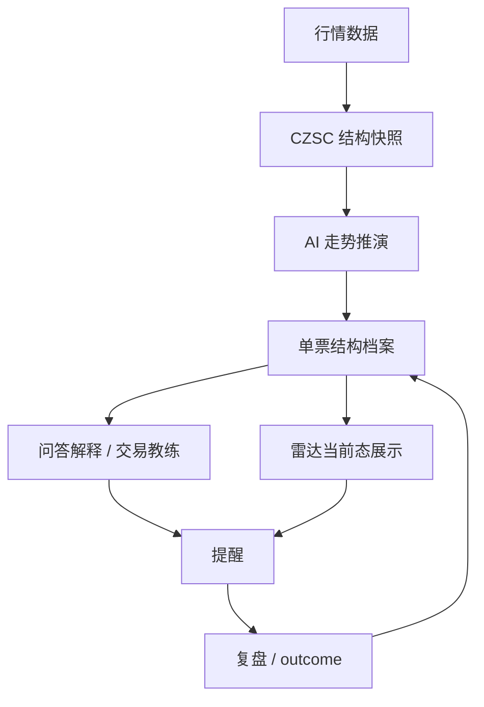

# AI Native V5.0 Reasoning Recovery Tasks

## 背景

当前 V5 雷达面板已经具备部分状态展示、复盘记录和问答入口，但主链路发生偏移：

```text
数据 -> 结构 -> 简化 context -> 雷达状态/模板问答
```

这不是我们设计的 AI Native V5 主链路。正确链路应该是：

```text
行情数据
-> CZSC 结构快照
-> AI 走势推演
-> 单票结构档案
-> 雷达当前态展示
-> 问答解释 / 交易教练
-> 提醒 / 复盘
-> 沉淀回单票档案
```

这份文档只解决一个问题：把缺失的 AI 推演层补回 V5 主路径，并让雷达和 chat 都围绕推演结果工作。

## 当前偏差

### 偏差 1：V5 context 没有真实 AI 推演

当前 `structure_context_service` 主要把 CZSC snapshot、边界、持仓拼成 context。

现状：

```text
CZSC snapshot -> boundary_json / background_json / summary_text
```

问题：

- 没有独立的 V5 推演 prompt。
- 没有保存 `reasoning_json`。
- 没有“走势如何生长”的动态判断。
- 没有主推演级别、触发级别、背驰、级别共振等结构推演字段。

### 偏差 2：chat 退化为 deterministic 模板

当前 `structure_chat_service` 是规则模板回答。

现状：

```text
用户问题 + ZG/ZD -> 模板回答
```

问题：

- 没有把 AI 推演结果给到 AI。
- 没有把单票历史记忆作为上下文输入。
- 无法回答“当前走势如何生长”“为什么这条分支更重要”。
- 用户问“现在能买吗”时，只能得到边界模板，不是交易教练式解释。

### 偏差 3：雷达第一屏没有 AI 推演

当前雷达面板更像：

```text
状态卡 + 复盘列表 + 快捷问题
```

问题：

- 第一屏没有当前 AI 推演摘要。
- 没有展示主推演级别和触发级别。
- 没有展示走势生长、背驰风险、级别共振。
- 复盘列表压过了“当前推演”。

## 目标链路

V5 必须回到以下主链路：



分层职责：

- 数据层：只负责 K 线、价格、更新时间。
- 结构层：CZSC 计算笔、中枢、背驰线索和多级别结构，不调用 AI。
- AI 推演层：读取结构事实，推演走势如何生长，输出主推演级别、触发级别、级别共振、分支假设。
- 单票档案层：保存当前结构状态、AI 推演、历史分支兑现、用户行为记忆。
- 雷达展示层：展示当前态，不重新计算，不重新推演。
- 问答解释层：读取推演结果、单票记忆、持仓和最近对话，回答用户自然问题。
- 提醒/复盘层：把分支转提醒，收线后验证触发或失效，再沉淀回单票档案。

## P0：恢复 AI 推演主链路

### Task 1：冻结旧 prompt 进入 V5 主路径

目标：

- V5 不再使用旧 `czsc_agent.py` 作为推演 prompt。
- 旧 prompt 可保留为历史文件，但不得进入 V5 context/chat/radar 主路径。

涉及文件：

- `server/prompts/czsc_agent.py`
- `server/engines/ai_native/*`
- `tests/test_ai_structure_no_legacy_calls.py`

验收：

- V5 测试能证明 `czsc_agent.py` 没有被 V5 context/chat 调用。
- V5 prompt version 不再是泛化的 `ai_structure_context.v1`，而是明确的推演版本。

### Task 2：新增 V5 AI 推演 prompt

目标：

- 新建 V5 专用推演提示词。
- 语言保持纯净缠论表达。
- 不强制三分类，不把 AI 绑死成固定模板。

建议文件：

- `server/prompts/ai_structure_reasoning_prompt.py`

Prompt version：

```text
ai_structure_reasoning.e1_dynamic_growth
```

必须覆盖：

- 主推演级别
- 触发级别
- 走势如何生长
- 中枢扩展 / 新生 / 离开 / 回拉
- 背驰与不背驰观察
- 级别共振
- A+小b 结构理解
- 分支假设
- 关键边界
- 空仓/持仓解释差异
- 风险提示

禁止：

- 强制输出固定三条线。
- 强制三场景分类。
- 使用“Commander / 战星 / 绝对分类”风格。
- 给直接买卖指令。

验收：

- prompt 文件独立存在。
- prompt version 可被 context job 记录。
- prompt 输入明确区分 `structure_facts`、`position_context`、`symbol_memory`、`background_context`。

### Task 3：定义 AI 推演输出 schema

目标：

- 让 AI 推演结果可落库、可展示、可给 chat 继续使用。

建议 schema：

```json
{
  "version": "ai_structure_reasoning.e1_dynamic_growth",
  "symbol": "sh.688008",
  "data_as_of": "2026-05-15 15:00:00",
  "main_level": "day",
  "trigger_level": "5",
  "structure_summary": "",
  "trend_growth": {
    "current_state": "",
    "growth_path": "",
    "next_confirmation": "",
    "failure_path": ""
  },
  "divergence_view": {
    "status": "none|potential|confirmed|unclear",
    "level": "",
    "evidence": "",
    "risk_note": ""
  },
  "resonance_view": {
    "higher_level_context": "",
    "lower_level_trigger": "",
    "resonance_type": "",
    "conflict_note": ""
  },
  "scenario_branches": [
    {
      "branch_type": "observe_breakout",
      "title": "",
      "main_level": "",
      "trigger_level": "",
      "trigger_condition": "",
      "invalidate_condition": "",
      "next_recheck": "",
      "chart_focus": []
    }
  ],
  "key_boundaries": [],
  "coach_summary": "",
  "risk_notes": []
}
```

验收：

- schema 支持 2-5 个分支，不要求固定数量。
- 每个分支都有触发条件、失效条件、观察级别。
- `coach_summary` 可直接作为雷达第一屏摘要。

### Task 4：改造 `structure_context_service`

目标：

当前：

```text
CZSC snapshot -> raw context -> summary_text
```

改为：

```text
CZSC snapshot
-> raw structure facts
-> AI 推演
-> reasoning_json
-> ai_structure_context
-> scenario branches
```

涉及文件：

- `server/engines/ai_native/structure_context_service.py`
- `server/workers/ai_structure_context_worker.py`
- `server/api/ai_structure.py`

关键规则：

- context job 可以异步调用 LLM。
- 页面请求不得同步调用 LLM。
- 没有 LLM 或 LLM 失败时，context 状态必须是 degraded/failed/pending，不能伪装为已推演。
- `raw_context_json` 保存结构事实。
- `reasoning_json` 保存 AI 判断。
- 结构事实和 AI 判断不能混在一个字段里。

验收：

- `get_latest_ai_structure_context` 返回 `reasoning_json`。
- `prompt_version` 等于 `ai_structure_reasoning.e1_dynamic_growth`。
- context job 失败时不会污染上一版有效推演。

### Task 5：数据库保存 AI 推演结果

目标：

- `ai_structure_contexts` 能保存完整推演结果。

建议字段：

```text
reasoning_json
main_level
trigger_level
coach_summary
```

如果短期不新增列，也必须至少把 `reasoning_json` 存入独立 JSON 字段，不能塞进 `summary_text`。

涉及文件：

- `server/db/database.py`
- `tests/test_ai_structure_context_service.py`

验收：

- 迁移后旧 context 不崩。
- 新 context 可查询到 `reasoning_json`。
- `main_level` / `trigger_level` 可用于雷达首屏和 chart focus。

### Task 6：scenario branches 从 AI 推演生成

目标：

- 分支不再只从 ZG/ZD 模板生成。
- 分支来自 `reasoning_json.scenario_branches`。

涉及文件：

- `server/engines/ai_native/scenario_branch_service.py`
- `server/engines/ai_native/structure_context_service.py`

验收：

- 每条 branch 保存 AI 推演来源 `source_context_version`。
- 分支数量由 AI 推演结果决定，不固定为 3。
- 每条分支能转提醒、能被 outcome 复盘。

## P1：恢复雷达和 chat 体验

### Task 7：chat 改为 AI 解释层

目标：

chat 不重新计算结构，也不重新做完整推演。chat 读取：

```text
用户问题
+ latest reasoning_json
+ raw structure facts
+ 单票历史记忆
+ 用户持仓/成本/纪律记录
+ 最近对话上下文
-> AI 交易教练式回答
```

涉及文件：

- `server/engines/ai_native/structure_chat_service.py`
- `server/engines/ai_native/scenario_outcome_service.py`
- `server/api/ai_structure.py`

关键规则：

- chat 可以调用 LLM 做解释，但不得调用 CZSC 或旧结构。
- chat 必须引用 latest context id 和 reasoning version。
- chat 回答必须能落回触发线、失败线、提醒条件。
- chat 可以有 deterministic guardrails，但核心内容不能只是模板。

验收：

- 用户问“我现在能买吗？”时，回答引用 `coach_summary`、主推演级别、触发级别、关键分支。
- 用户问“跌破哪里就不看了？”时，回答引用失效条件和 chart evidence。
- 用户问“走势怎么生长？”时，回答引用 `trend_growth`。
- 用户问“有没有背驰？”时，回答引用 `divergence_view`。

### Task 8：workspace bootstrap 暴露推演摘要

目标：

- 雷达首屏能直接拿到 AI 推演摘要，不再前端拼。

涉及文件：

- `server/engines/ai_native/workspace_bootstrap_service.py`
- `server/api/ai_structure.py`

建议返回：

```json
{
  "latest_context": {
    "context_id": "",
    "prompt_version": "ai_structure_reasoning.e1_dynamic_growth",
    "main_level": "day",
    "trigger_level": "5",
    "coach_summary": "",
    "trend_growth": {},
    "divergence_view": {},
    "resonance_view": {},
    "active_branches": []
  }
}
```

验收：

- bootstrap 第一屏数据包含 AI 推演摘要。
- bootstrap 不暴露完整 raw CZSC 对象。
- bootstrap 不触发同步推演。

### Task 9：雷达面板重排

目标：

雷达第一屏要回到“AI 推演工作台”，不是复盘列表。

建议顺序：

```text
1. 当前 AI 推演摘要
2. 主推演级别 / 触发级别
3. 走势如何生长
4. 当前关键分支
5. 关键边界与图表证据
6. 问答窗口
7. 最近复盘折叠区
```

涉及文件：

- `web/src/features/radar/*`

验收：

- 第一屏能看到 AI 推演摘要。
- 复盘列表不再压过当前推演。
- 快捷问题围绕当前推演生成，而不是固定按钮。

### Task 10：Kline 证据联动

目标：

- 图表只显示当前回答相关证据。
- 不做复杂多级别嵌套。

涉及文件：

- `server/engines/ai_native/structure_evidence_service.py`
- `server/engines/ai_native/structure_view_service.py`
- `web/src/features/radar/*`

验收：

- AI 回答返回的 `chart_focus.evidence_ids` 能在 chart context 里找到。
- 图表高亮 active center、trigger line、invalidation line、背驰观察点。
- stale evidence 有明确提示。

## P2：提醒、复盘和单票档案沉淀

### Task 11：提醒从 AI 分支生成

目标：

- 用户可以把某条推演分支转成提醒。

例子：

- 站上某线提醒。
- 跌破失败线提醒。
- 5 分钟回踩不破提醒。

验收：

- reminder 保存 branch_id、context_id、evidence_id。
- reminder 触发后能进入 outcome 复盘。

### Task 12：复盘 outcome 回写单票档案

目标：

- 分支触发或失效后写回单票档案。

保存：

- 哪条分支触发。
- 哪条分支失效。
- AI 推演是否兑现。
- 用户是否执行纪律。

验收：

- outcome worker 能结算 pending branches。
- 单票档案可读到最近结构兑现情况。

### Task 13：单票结构档案增强

目标：

- 每只票长期形成自己的结构性格。

沉淀内容：

- 哪些级别更有效。
- 哪些分支经常失败。
- 用户在这只票上常犯什么错。
- 类似结构历史表现。

验收：

- chat 可以读取轻量 `symbol_memory`。
- memory 只作为提醒和解释，不覆盖当前结构边界。

## 防跑偏测试

必须补以下测试：

```text
1. V5 context job 必须生成 reasoning_json。
2. V5 prompt version 必须是 ai_structure_reasoning.e1_dynamic_growth。
3. V5 context/chat 不允许调用 czsc_agent.py。
4. chat 必须引用 reasoning_json，而不是只看 ZG/ZD 模板。
5. radar bootstrap 必须返回 AI 推演摘要。
6. 页面请求不允许同步调用 CZSC 或 LLM。
7. scenario branches 必须来自 reasoning_json.scenario_branches。
8. missing LLM / LLM failed 时状态必须 degraded/failed/pending，不能伪装成功。
```

## 第一轮开工范围

第一轮只做 P0 + P1 的最小闭环：

```text
给一只票
-> 已有 CZSC snapshot
-> 生成 AI 推演
-> 保存 reasoning_json
-> 保存单票 context
-> chat 能基于推演回答
-> radar bootstrap 能拿到推演摘要
```

不在第一轮做：

- 完整 UI 重绘。
- 完整单票长期记忆统计。
- 复杂回测。
- 多模型对比。
- 自动交易或下单。

## 关键判断

这次修复不是“让面板多显示几行字”，而是把 V5 的中枢链路重新接上：

```text
结构事实负责可靠
AI 推演负责生长
单票档案负责记忆
chat 负责解释和约束
雷达负责当前态展示
提醒/复盘负责闭环沉淀
```

只有这个链路恢复，AI Native V5 才不是传统雷达套一层聊天框。
